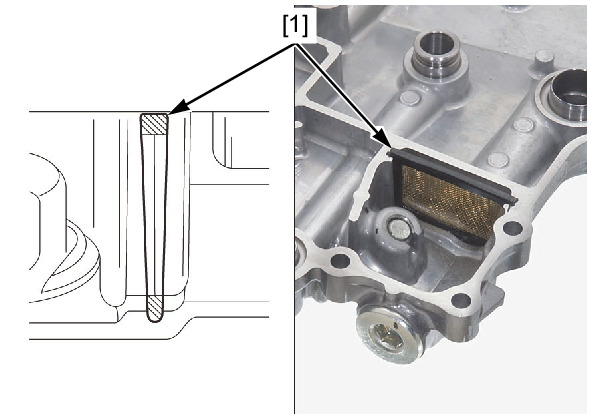
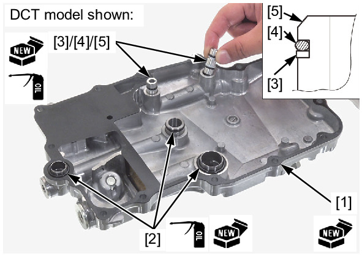
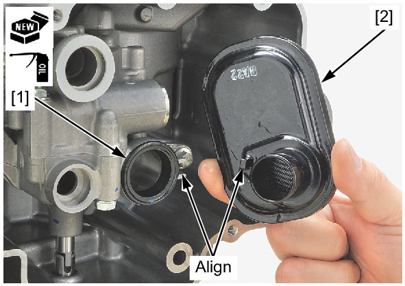
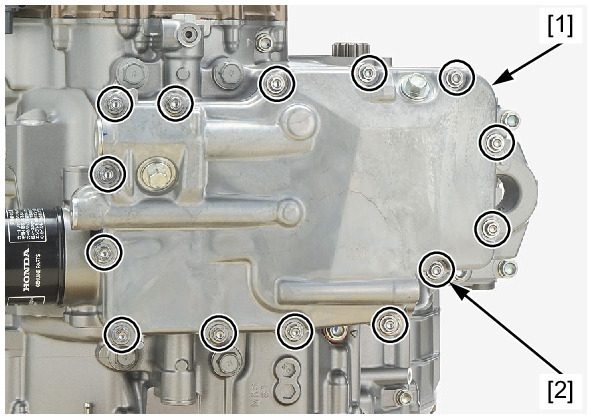

# Oil-Strainer Install

Источник: `Oil-Strainer Install.pdf`

INSTALLATION 
Install the oil filter screen [1] into the oil pan in the direction as shown. 
Apply engine oil to a new O-rings. 
Install the new gasket [1] and O-rings [2] to the oil pan. 
Apply engine oil to a new O-rings. 
Install the new back up rings [3] and O-rings [4] to the oil joints [5]. 
Install the oil joints to the oil pan. 
! DCT model: 

NOTE: 
* Install the back up rings and O-rings to the oil joints as shown. 

Apply engine oil to a new seal ring. 
Install the seal ring [1] to the oil pump. 
Install the oil strainer [2]. 

NOTE: 
* Align the oil strainer boss with the oil pump groove. 
Install the oil pan [1]. 
Install and tighten the bolts [2] in a crisscross pattern in 2 or 3 steps. 
Fill the engine with the recommended engine oil and check that there are no oil leaks . 

