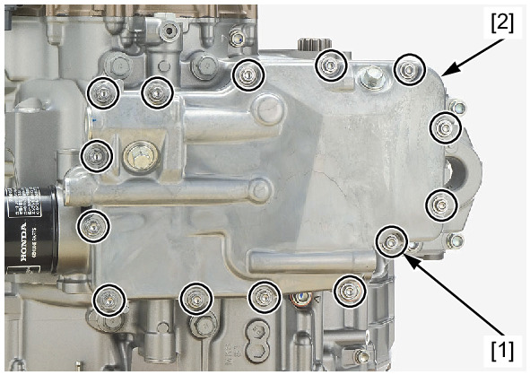
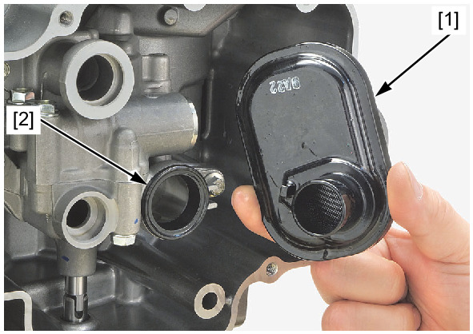
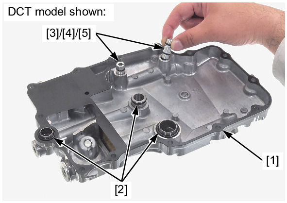
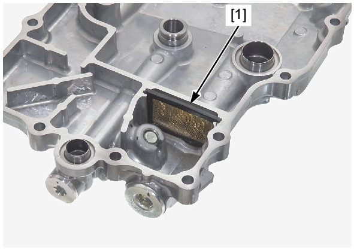

# Oil-Strainer Removal

Источник: `Oil-Strainer Removal.pdf`

REMOVAL 
Drain the engine oil . 
Loosen the bolts [1] in a crisscross pattern in 2 or 3 steps. 
Remove the bolts and oil pan [2]. 
Remove the oil strainer [1] and seal ring [2]. 
Clean the oil strainer and check for damage, replace it if necessary. 

Remove the gasket [1] and O-rings [2] from the oil pan. 
Remove the oil joints [3] from the oil pan. 
Remove the O-rings [4] and back up rings [5] from the oil joints. 
! DCT model: 
Remove the oil filter screen [1] from the oil pan. 
Clean the oil filter screen and check for damage, replace it if necessary. 

