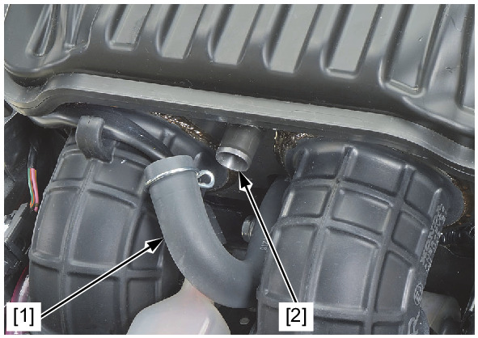
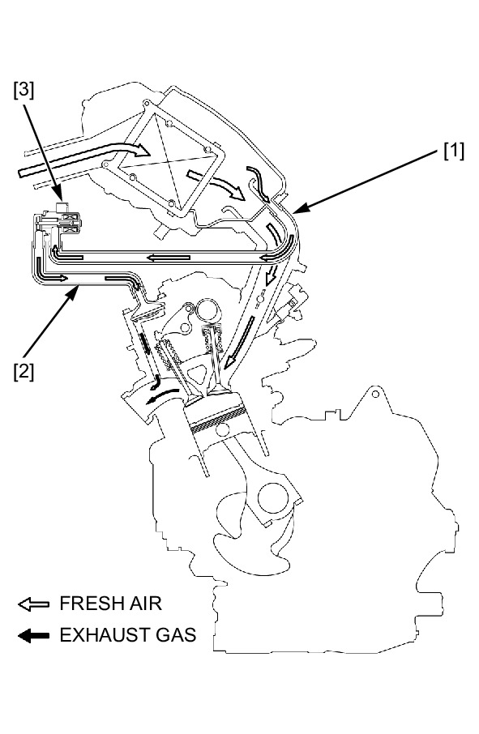

# PAIR - Inspection

Источник: `PAIR - Inspection.pdf`

SYSTEM INSPECTION 
Start the engine and warm it up to normal operating temperature. 
Stop the engine. 
Remove the fuel tank . 
Disconnect the air suction hose [1]. 
Check that the secondary air intake port [2] is clean and free of carbon deposits. 
Check the PAIR reed valve if the port is carbon fouled . 
Temporarily install the removed parts. 
Lift the fuel tank . 
Start the engine and open the throttle slightly to be certain that air is sucked in through the disconnected air suction hose [1]. 
If the air is not drawn in, check the air suction hose and air supply hose [2] for clogs. 
If the hoses are OK, check the PAIR control solenoid valve [3] . 

