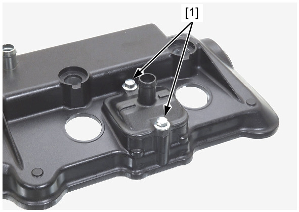
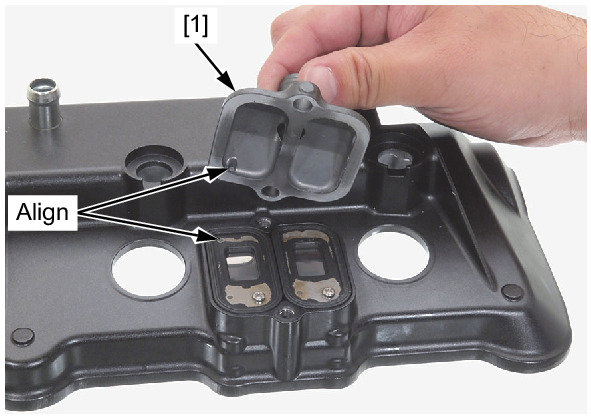
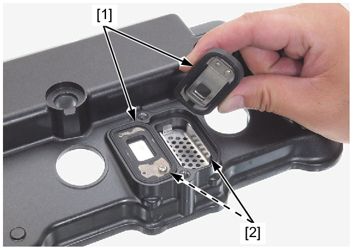
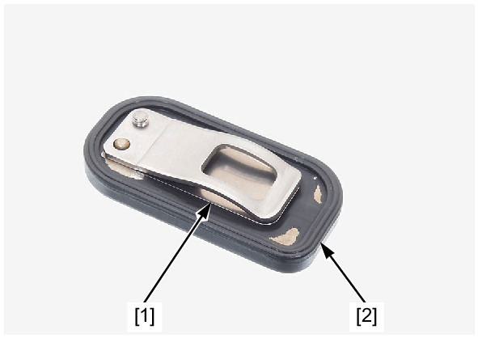

# PAIR - Reed Valve

Источник: `PAIR - Reed Valve.pdf`

PAIR REED VALVE 
REMOVAL/INSTALLATION 
Remove the cylinder head cover . 
Remove the PAIR reed valve cover bolts [1]. 
Remove the PAIR reed valve cover [1]. 

NOTE: 
* When installing the PAIR reed valve cover, align the boss of the PAIR reed valve cover with the hole of the PAIR reed valve. 

Remove the PAIR reed valves [1] and port plates [2]. 
Installation is in the reverse order of removal. 
TORQUE: 
PAIR reed valve cover bolt: 
12 N·m (1.2 kgf·m, 9 lbf·ft) 

NOTE: 
* Install the PAIR reed valves and port plates as shown. 
INSPECTION 
Remove the PAIR reed valves . 
Check the reed valve [1] for damage or fatigue. 
Replace if necessary. 
Replace the PAIR check valve if the rubber seat [2] is cracked, deteriorated or damaged, or if there is clearance between the reed and 
seat. 
Install the PAIR reed valves . 

