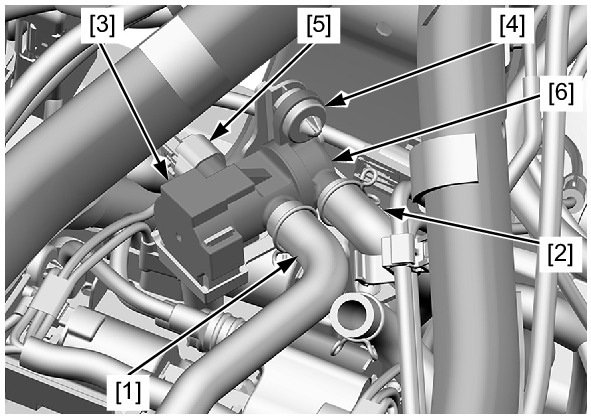
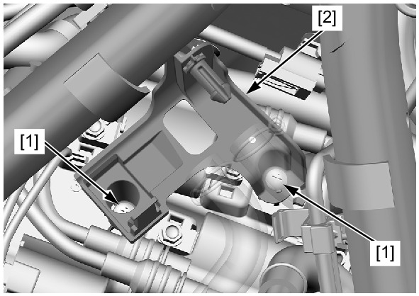
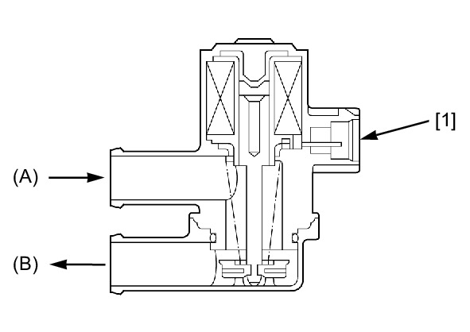

# PAIR - Removal & Check

Источник: `PAIR - Removal & Check.pdf`

PAIR CONTROL SOLENOID VALVE 
REMOVAL/INSTALLATION 
Remove the air cleaner housing . 
Disconnect the air suction hose [1] 
and air supply hose [2]. 
Release the suspension rubber [3] 
from the PAIR control solenoid valve 
stay. 
Release the grommet [4] from the 
boss. 
Disconnect the PAIR control solenoid 
valve 2P (Black) connector [5]. 
Remove the PAIR control solenoid 
valve [6]. 
Remove the suspension rubber and 
grommet from the PAIR control 
solenoid valve. 

Remove the screws [1] and PAIR 
control solenoid valve stay [2]. 
Installation is in the reverse order of 
removal. 
INSPECTION 
Remove the PAIR control solenoid 
valve . 

Check the air flow through the 
solenoid valve. 
Air should flow from suction hose 
fitting (A) to supply hose fitting (B). 
Connect a 12 V battery to the 2P 
connector [1] of the PAIR control 
solenoid valve. 
Air should not flow when the battery is 
connected. 
Replace the solenoid valve if it does 
not operate properly. 
Install the PAIR control solenoid 
valve . 

