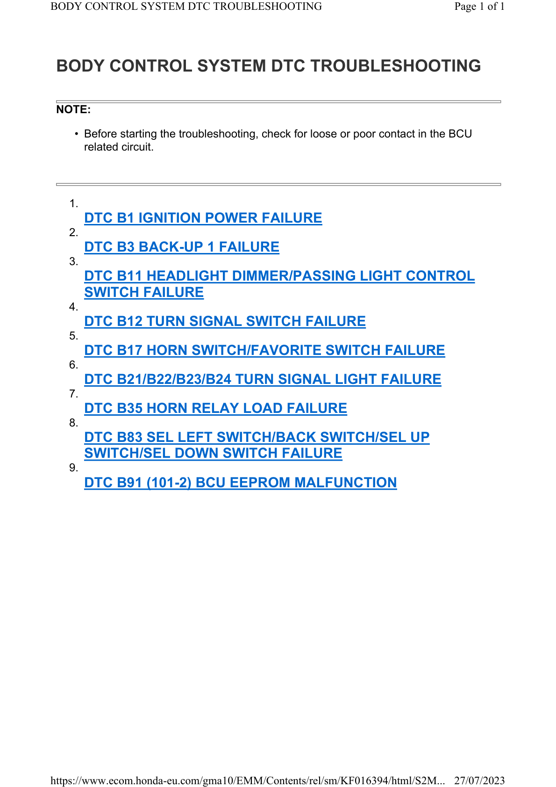

# PGM-FI - Body Ctrl DTC Troubleshooting

Источник: `PGM-FI - Body Ctrl DTC Troubleshooting.pdf`

BODY CONTROL SYSTEM DTC TROUBLESHOOTING 

NOTE: 
* Before starting the troubleshooting, check for loose or poor contact in the BCU 
related circuit. 
1.
DTC B1 IGNITION POWER FAILURE 
2.
DTC B3 BACK-UP 1 FAILURE 
3.
DTC B11 HEADLIGHT DIMMER/PASSING LIGHT CONTROL 
SWITCH FAILURE 
4.
DTC B12 TURN SIGNAL SWITCH FAILURE 
5.
DTC B17 HORN SWITCH/FAVORITE SWITCH FAILURE 
6.
DTC B21/B22/B23/B24 TURN SIGNAL LIGHT FAILURE 
7.
DTC B35 HORN RELAY LOAD FAILURE 
8.
DTC B83 SEL LEFT SWITCH/BACK SWITCH/SEL UP 
SWITCH/SEL DOWN SWITCH FAILURE 
9.
DTC B91 (101-2) BCU EEPROM MALFUNCTION 

