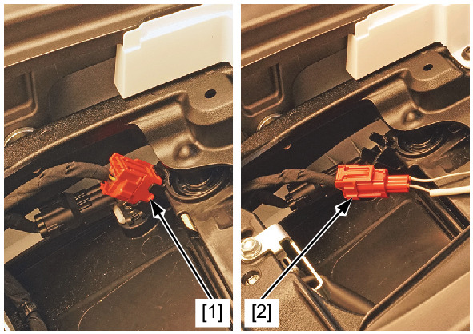
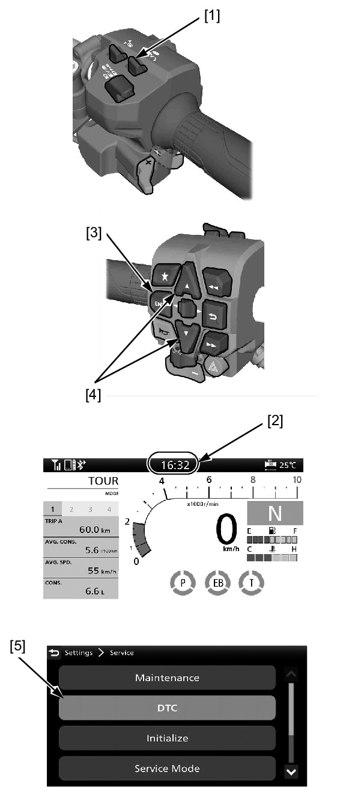
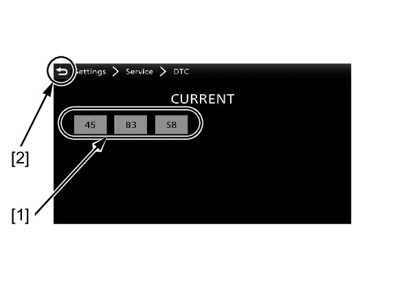

# PGM-FI - DTC Reading

Источник: `PGM-FI - DTC Reading.pdf`

DTC READOUT 
Start the engine and check the MIL. 
If the MIL stays on, connect the GST to the DLC or connect the MCS to the DLC . 
Read the DTC, stored data and follow the DTC index . 
To read the DTC by the MIL blinks, refer to the following procedure. 
Reading DTC with the MIL 
Turn the ignition switch OFF. 
Remove the main seat . 
Remove the dummy connector [1] from the DLC. 
Short the DLC terminals using a special tool. 
TOOL: 
SCS short connector [2] 
070MZ-0010300 
CONNECTION: Yellow – Green/blue 
Turn the ignition switch ON, read, note the MIL blinks and refer to the DTC 
index . 

Reading DTC with the MID 
1. Pull and hold the page switch [1] or touch the clock area [2] of the 
MID. 
2. Select the "Settings", and then press the ENT switch [3]. 
Select the "Service" with pushing the sel up/down switch [4] or touch 
screen, and then press the ENT switch. 
Select the "DTC" [5], and then press the ENT switch. 

3. Read the DTC [1]. 

NOTE: 
* For returning to the riding information, previous screen, or Home 
screen: 

* Pull the page switch 
* Touch the return icon [2] on the touch screen of the MID 

