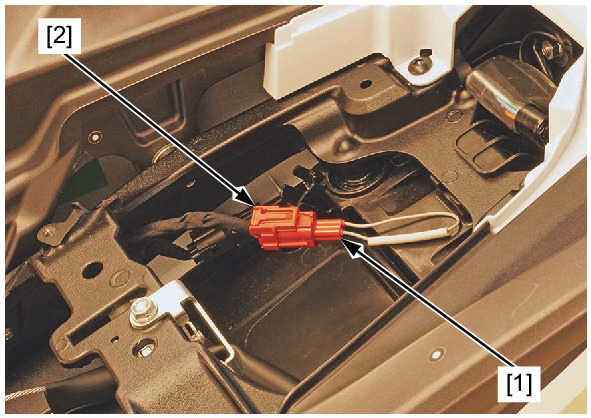

# PGM-FI - Erasing Stored DTC

Источник: `PGM-FI - Erasing Stored DTC.pdf`

ERASING STORED DTC 

NOTE: 
* When the ERASING DTC procedure is performed, the DTCs of DCT system are erased at the same time. 
Erase the DTC with the GST or MCS while the engine is stopped. 
To erase the DTC without GST or MCS, refer to the following procedure. 
How to clear the DTC with SCS short connector 
1. Connect the SCS connector to the DLC . 
2. Turn the ignition switch ON. 
3. Disconnect the SCS short connector [1] from the DLC [2]. 
Reconnect the SCS short connector to the DLC while the MIL stays 
ON about 5 seconds (reset receiving pattern). 
4. The stored DTC is erased if the MIL goes off and starts blinking 
(successful pattern). 
* The DLC must be jumped while the MIL light in ON. If not, the 
MIL will not start blinking. In that case, turn the ignition switch 
OFF and try again. 
* Note that the self-diagnostic memory cannot be erased if the 
ignition switch is turned OFF before the MIL starts blinking. 

