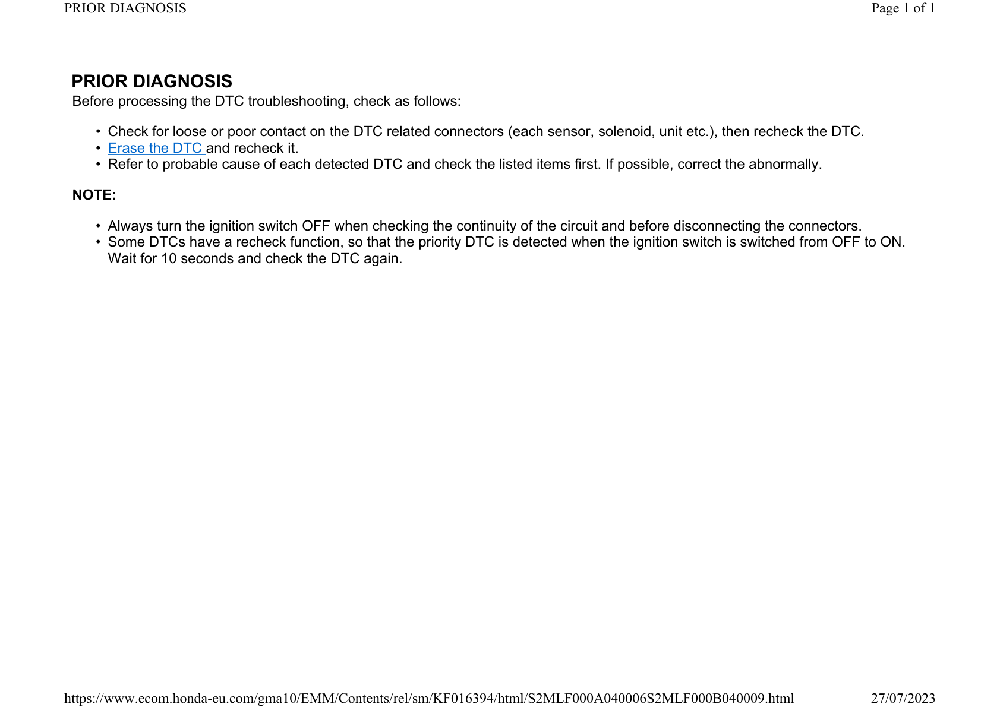

# PGM-FI - Prior Diagnosis

Источник: `PGM-FI - Prior Diagnosis.pdf`

PRIOR DIAGNOSIS 
Before processing the DTC troubleshooting, check as follows: 
* Check for loose or poor contact on the DTC related connectors (each sensor, solenoid, unit etc.), then recheck the DTC. 
* Erase the DTC and recheck it. 
* Refer to probable cause of each detected DTC and check the listed items first. If possible, correct the abnormally. 

NOTE: 
* Always turn the ignition switch OFF when checking the continuity of the circuit and before disconnecting the connectors. 
* Some DTCs have a recheck function, so that the priority DTC is detected when the ignition switch is switched from OFF to ON. 
Wait for 10 seconds and check the DTC again. 

