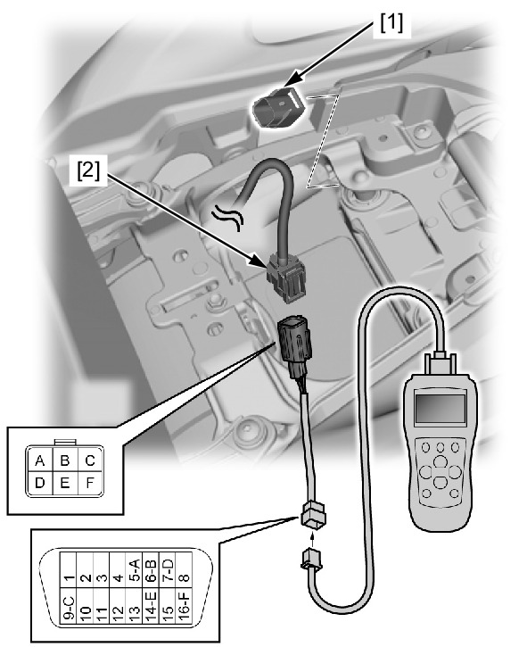

# PGM-FI - Scan Tool Connection

Источник: `PGM-FI - Scan Tool Connection.pdf`

GST (Generic Scan Tool) INFORMATION 
* The GST can readout the DTC, stored data, current data and other ECM condition. 
How to connect the GST 
Turn the ignition switch OFF. 
Remove the main seat . 
Remove the dummy connector [1] from the DLC [2]. 
Connect the special tool to the DLC. 
Connect the GST to the DLC. 
Turn the ignition switch ON. 
Check the DTC and stored data. 
OBD harness circuit connection (General allocation in ISO 15031-3) 
DLC 6P 
16P 
Signal ground 
A 
5 
CAN_H 
B 
6 
Discretionary (SCS line) 
C 
9 
K-line 
D 
7 
CAN_L 
E 
14 
Permanent positive battery 
F 
16 

