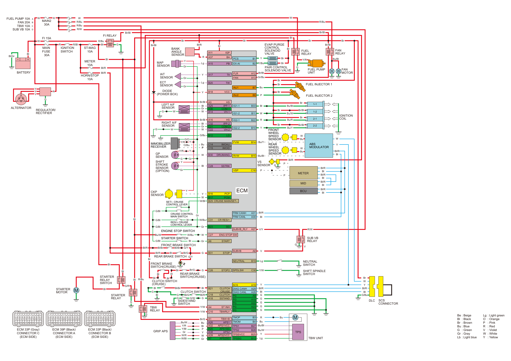

# PGM-FI - System Diagram

Источник: `PGM-FI - System Diagram.pdf`

PB
A15
BA
A37
IGP
A11
B7
INJ1
B8
INJ2
B33
IG1-1
B11
IG1-2
B22
IG2-1
B10
IG2-2
B14
FVW
B15
RVW
C16
VSP
A27
SUBVB_RLY
A8
SUBVB
B2
EX-AI
B1
PCS
A12
FLR
A13
FAN
VCC
B18
TA
A17
TW
B20
LG
B12
B29
CR RES/+
C31
ENG STOP SW
C27
SG
B23
START
A6
STOP
B31
STOP2
C26
IMOAU
C14
IMOID
C15
PCP
B16
PCM
B17
SSTAND
A18
ST INH
A4
TBWRLY
C10
CRUISE MAIN/SET–
SSTRK
C28
DRUMANG
B30
CLUTCH
 CRUISE
B21
NEUTRAL
B19
SPDLSW
C30
CLUTCH
C18
A31
FRM CANH
A30
FRM CANL
1
12
23
2
13
24
3
14
25
4
15
26
5
16
27
6
17
28
7
18
29
8
19
30
9
20
31
10
21
32
11
22
33
1
2 3
14
4
15
5
16
27
6
17
28
7
18
29
8
19
30
9
20
31
10
21
32
11 12 13
22 23 24 25 26
33 34 35 36 37 38 39
1
12
23
2
13
24
3
14
25
4
15
26
5
16
27
6
17
28
7
18
29
8
19
30
9
20
31
10
21
32
11
22
33
B3
TMOP
B4
TMOM
B27
TPS1
B28
TPS2
B25
TPSSVCC
B13
TPSSG
TBW+B
A1
APS1
A26
APS1VCC
A32
APS1SG
A20
APS2
A38
APS2VCC
A39
APS2SG
A7
A19
SCS
A29
DIAG CANH
A28
DIAG CANL
A9
PG
A10
PG
A22
PG
A23
PG
A24
PG
HS
A16
IPP-2
C32
COM-2
C21
VH-2
C22
HS
A3
IPP-1
A25
COM-1
A36
VH-1
A14
2-1
1-1
1-2
2-2
Br
Br
Br
G/Bl
G/Bl
G/Bl
Lg
Lg
Y
Y
Y
Y
Y
Y
Y/R
Y
Br
Br
Br/Bl
Br
Br
Br
Br
Br
Br
Br
Br/Bl
Br/Bl
Br
Y
Y
Y
R
R
R/Bl
Bl
Y
Gr
Gr
Gr
Gr
Gr
Gr
G
G
G
G
W
G
G
G
G
G
G
R
G
G
G
G/W
Br/Bl
Br/Bl
Gr
W
W
W
R
G/Bu
G
G
Bl
Bl
Bl
Bl
Bl
Bl
Bl
Bl
W
Bl
Gr
W
W
W
W
Bu
Bu
W
Bu
Bu
O/Bu
G/O
Y/R
Y
Y
W
W/Bu
W
W
W/Bu
W/Bl
G/Bl
Bu/W
Bl/R
Bl/Br
Bl/Br
G/Y
G/Y
Bl/R
Bl/G
Bl
Bl
Y/W
P
P
P
P
P
Bl
Bl
Bl
Bl
Bl
Bl
Bl/Gr
G/R
Y/W
R/Bu
Br/G
R/Bu
Br/Bl
R/Bu
R/Bu
R/W
W
W
W
R
A
B
C
D
A
B
C
D
Bu
Bu
Lg
Br
P
Y
Y
W
Gr
Y/Bu
Br
Br
Br/Bl
Gr/Bu
Bu/Bl
R/Bu
Bu/Bl
Bu/Bl
Bu/Bl
Bu/W
Bu/W
Br/Bl
Br/Bl
Bu/R
Bu/Y
Bu/Y
Bl/R
Bl/R
Bl
Bl/R
Bl
Bl/R
Bl/R
Bl/R
Bl
Bl/R
Bl/R
Bl/R
V/Y
V
V
R/W
G/Bu
Br
Bl/R
Bl/R
Bl
Bl
Bl/Br
Lg
Y/W
Bl/R
Bl/G
Bl
G
G
P
Gr
Y
Bl
Gr
G
Y
Y/R
W
Br
Be
Bl
Br
Bu
G
Gr
Lb
: Beige
: Black
: Brown
: Blue
: Green
: Gray
: Light blue
Lg
O
P
R
V
W
Y
: Light green
: Orange
: Pink
: Red
: Violet
: White
: Yellow
Bu/W
Y/R
Y/Bl
Gr
W/R
W/Bl
G
G
G
Y
Br/G
Bl
Br
Bl
Br
Bl
R
Bl/R
W
Bu
MAP
SENSOR
ECT
SENSOR
IAT
SENSOR
DIODE
(POWER BOX)
RIGHT A/F
SENSOR
LEFT A/F
SENSOR
IMMOBILIZER
RECEIVER
REAR BRAKE SWITCH
FRONT BRAKE SWITCH
REAR BRAKE
SWITCH(CRUISE)
STARTER
RELAY
STARTER
RELAY
SWITCH
STARTER
MOTOR
ALTERNATOR
CKP
SENSOR
CRUISE CONTROL 
MAIN SWITCH
SET/– CRUISE 
CONTROL LEVER
ENGINE STOP SWITCH
STARTER SWITCH
FRONT BRAKE
SWITCH(CRUISE)
TBW
RELAY
GRIP APS
EVAP PURGE
CONTROL
SOLENOID
VALVE
FUEL PUMP
UNIT
FAN
MOTOR
FUEL INJECTOR 2
FUEL INJECTOR 1
IGNITION
COIL
ABS
MODULATOR
REAR
WHEEL
SPEED
SENSOR
FRONT
WHEEL
SPEED
SENSOR
VS
SENSOR
ECM
TBW UNIT
TPS
SCS
CONNECTOR
DLC
METER
MID
BCU
PAIR CONTROL
SOLENOID VALVE
FAN
RELAY
SUB VB
RELAY
SIDESTAND
SWITCH
REGULATOR/
RECTIFIER
FI RELAY
BATTERY
IGNITION
SWITCH
MAIN2
30A
MAIN
FUSE
 30A
FI 15A
SUB VB 10A
METER
10A
HORN/STOP
10A
ST-MAG
10A
TBW 10A
FUEL PUMP 10A
FAN 20A
GP
SENSOR
SHIFT
STROKE
SENSOR
(OPTION)
CLUTCH SWITCH
(CRUISE)
NEUTRAL
SWITCH
SHIFT SPINDLE
SWITCH
CLUTCH SWITCH
FUEL
RELAY
ECM 33P (Black)
CONNECTOR B
(ECM SIDE)
ECM 39P (Black)
CONNECTOR A
(ECM SIDE)
ECM 33P (Gray)
CONNECTOR C
(ECM SIDE)
RES/+ CRUISE 
CONTROL LEVER
BANK 
ANGLE
SENSOR
