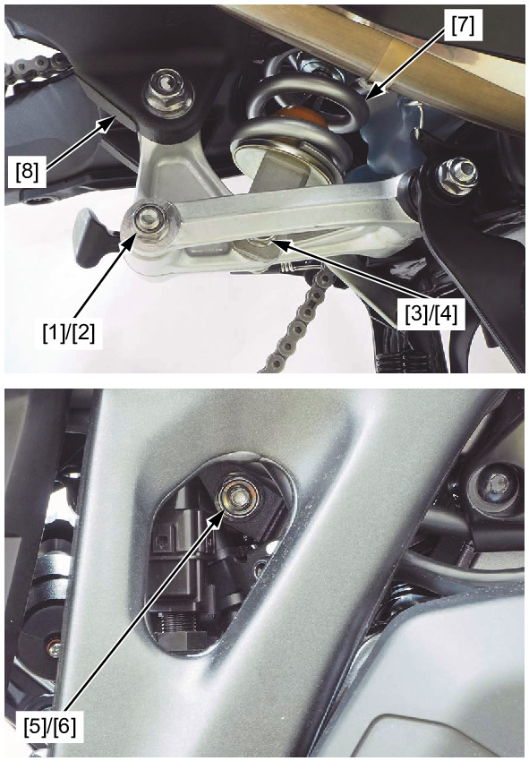

# Rear Suspension - Shock Absorber

Источник: `Rear Suspension - Shock Absorber.pdf`

REMOVAL/INSTALLATION 
Support the motorcycle using a safety stand or hoist, and raise the rear wheel off the ground. 
Remove the cushion connecting rod nut (rear side) [1] and cushion connecting rod bolt (rear side) [2]. 
Remove the shock absorber lower nut [3] and shock absorber lower bolt [4]. 
Remove the shock absorber upper nut [5] and shock absorber upper bolt [6]. 
Remove the shock absorber [7] downward. 

NOTE: 
* Lift the swingarm [8] and remove the shock absorber while turning it. 
Installation is in the reverse order of removal. 
TORQUE: 
Shock absorber upper nut: 
54 N·m (5.5 kgf·m, 40 lbf·ft) 
Shock absorber lower nut: 
44 N·m (4.5 kgf·m, 32 lbf·ft) 
Cushion connecting rod nut (rear side): 
54 N·m (5.5 kgf·m, 40 lbf·ft) 

NOTE: 
* Install the bolts from the left side. 

