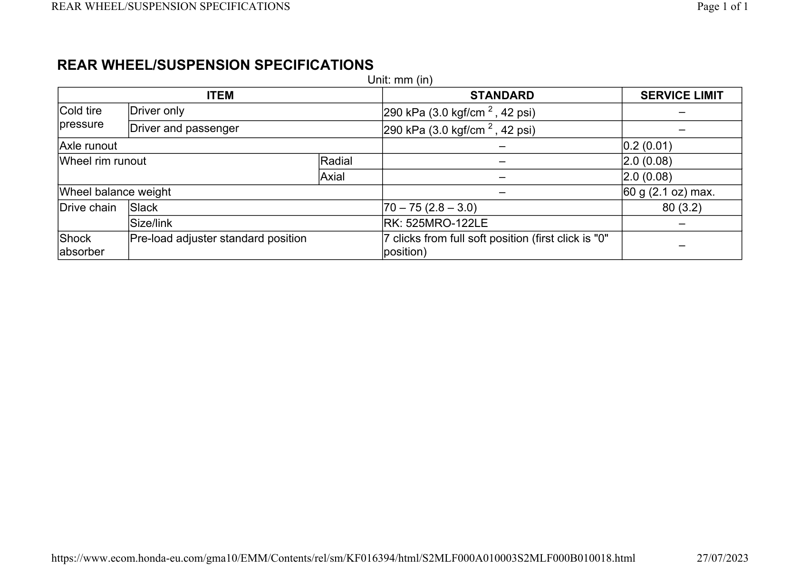

# Rear Suspension Specifications

Источник: `Rear Suspension Specifications.pdf`

REAR WHEEL/SUSPENSION SPECIFICATIONS 
Unit: mm (in) 
ITEM 
STANDARD 
SERVICE LIMIT 
Cold tire 
pressure 
Driver only 
290 kPa (3.0 kgf/cm 2 , 42 psi) 
– 
Driver and passenger 
290 kPa (3.0 kgf/cm 2 , 42 psi) 
– 
Axle runout 
– 
0.2 (0.01) 
Wheel rim runout 
Radial 
– 
2.0 (0.08) 
Axial 
– 
2.0 (0.08) 
Wheel balance weight 
– 
60 g (2.1 oz) max. 
Drive chain 
Slack 
70 – 75 (2.8 – 3.0) 
80 (3.2) 
Size/link 
RK: 525MRO-122LE 
– 
Shock 
absorber 
Pre-load adjuster standard position 
7 clicks from full soft position (first click is "0" 
position) 
– 

