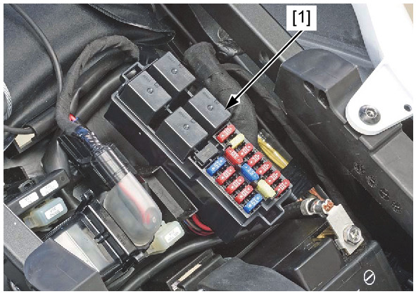

# Relays - Fuel

Источник: `Relays - Fuel.pdf`

REMOVAL/INSTALLATION 
Remove the main seat . 
Remove the power box cover and fuel relay [1]. 
Installation is in the reverse order of removal. 
* For relay inspection 

