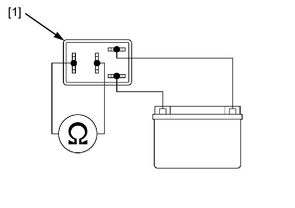

# Relays - Inspection

Источник: `Relays - Inspection.pdf`

RELAY INSPECTION 
Remove the TBW relay . 
Connect an ohmmeter to the TBW relay [1] 
terminals as shown. 
Connect a 12 V battery to the TBW relay terminals 
as shown. 
There should be continuity only when 12 V battery 
is connected. 
If there is no continuity when the 12 V battery is 
connected, replace the TBW relay. 
Install the TBW relay . 

