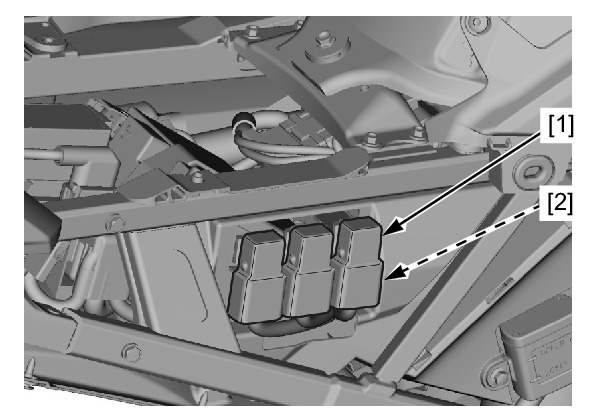

# Relays - Starter

Источник: `Relays - Starter.pdf`

REMOVAL/INSTALLATION 
Remove the right rear side cowl . 
Release the starter relay [1] from the stay. 
Disconnect the relay connector [2] and remove the 
starter relay. 
Installation is in the reverse order of removal. 
* For relay inspection 

