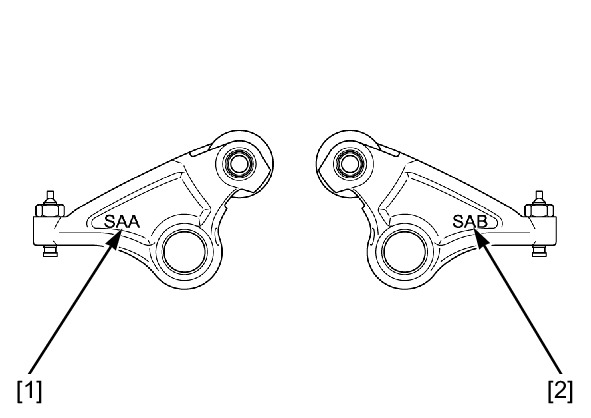
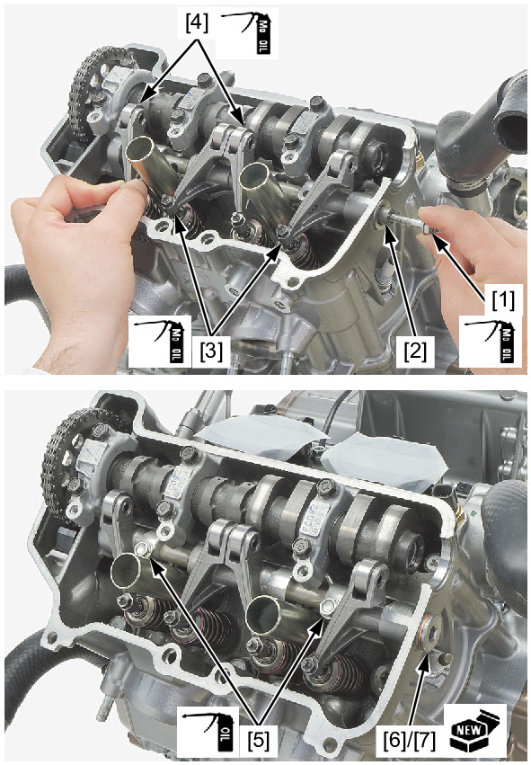

# Rocker Arm - Install

Источник: `Rocker Arm - Install.pdf`

INSTALLATION 
Turn the crankshaft counterclockwise and align the "T1" mark [1] on the flywheel with the index mark [2] of the 
alternator cover. 
Make sure that the index lines [3] on the cam sprocket align with the upper surface of the cylinder head and the 
punch mark [4] on the sprocket is visible. 

The rocker arms have the following identification marks: 
* "SAA" mark [1]: rocker arm A 
* "SAB" mark [2]: rocker arm B 
Apply molybdenum oil solution to the rocker arm sliding area and thrust surface. 
Apply molybdenum oil solution to the rocker arm shaft outer surface. 
Temporarily install the suitable 6 mm bolt [1] to the rocker arm shaft [2]. 
Install the rocker arms A [3] and B [4]. 
Install the rocker arm shaft. 

NOTE: 
* Install the rocker arm shaft by aligning its grooves with the rocker arm shaft bolt holes of the cylinder head. 
Apply engine oil to the rocker arm shaft bolt threads and seating surface. 
Install and tighten the rocker arm shaft bolts [5] to the specified torque. 
TORQUE: 12 N·m (1.2 kgf·m, 9 lbf·ft) 
Remove the suitable 6 mm bolt from the rocker arm shaft. 
Install the rocker arm shaft stopper bolt [6] and a new sealing washer [7]. 
Tighten the rocker arm shaft stopper bolt to the specified torque. 
TORQUE: 18 N·m (1.8 kgf·m, 13 lbf·ft) 
Install the following: 
* Cylinder head cover 
* Crankshaft hole cap 
* Timing hole cap 

