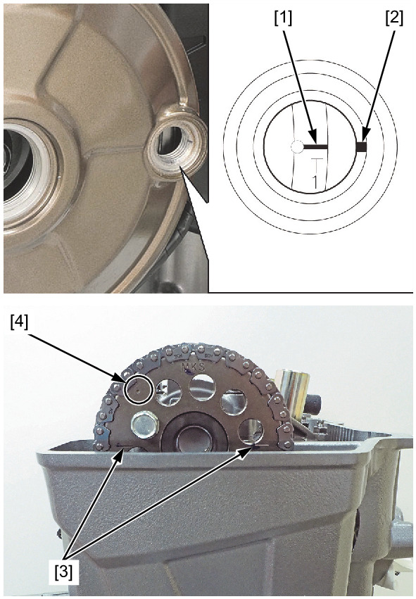
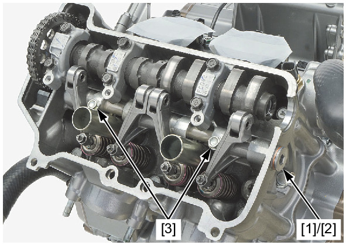
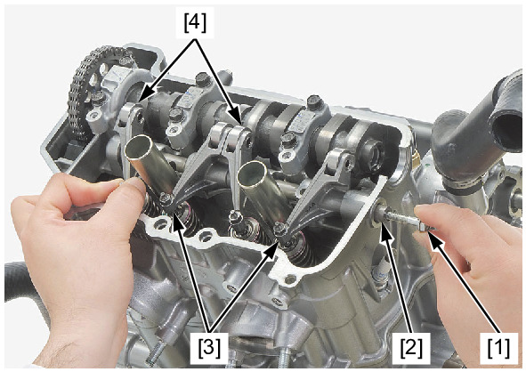

# Rocker Arm - Removal

Источник: `Rocker Arm - Removal.pdf`

REMOVAL 
Remove the following: 
* Cylinder head cover 
* Crankshaft hole cap 
* Timing hole cap 
Turn the crankshaft counterclockwise and align the "T1" mark [1] on the flywheel with the index mark [2] of the alternator 
cover. 
Make sure that the index lines [3] on the cam sprocket align with the upper surface of the cylinder head and the punch mark 
[4] on the sprocket is visible. 

Remove the rocker arm shaft stopper bolt [1], sealing washer [2], and rocker arm shaft bolts [3]. 
Temporarily install the suitable 6 mm bolt [1] to the rocker arm shaft [2]. 
Remove the rocker arm shaft by pulling suitable 6 mm bolt. 
Remove the suitable 6 mm bolt from the rocker arm shaft. 
Remove the rocker arms A [3] and B [4]. 

