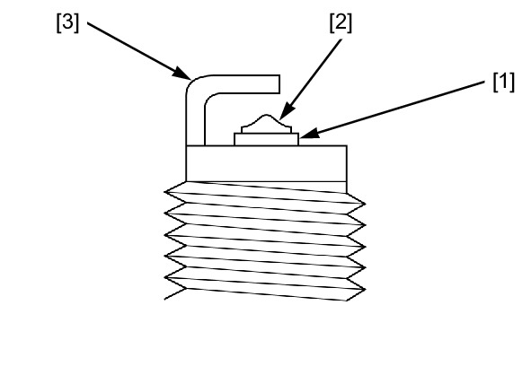
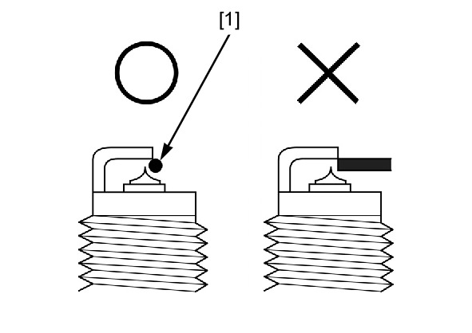

# Spark Plug Inspection

Источник: `Spark Plug Inspection.pdf`

INSPECTION 
Check the following and replace the spark plug if necessary. 
* Insulator [1] for damage 
* Center electrode [2] and side electrode [3] for wear 
* Coloration or burning condition 

NOTE: 
* This motorcycle’s spark plugs are equipped with an iridium center electrode. Do not clean the electrodes. 
If the electrodes are contaminated with accumulated objects or dirt, replace the spark plug. 
SPECIFIED SPARK PLUG: SILMAR8A9S (NGK) 
Check the gap between the center and side electrodes with a wire type feeler gauge [1]. 

NOTE: 
* To prevent damaging the iridium center electrode, use a wire type feeler gauge to check the spark plug 
gap. 
Make sure that the Φ 1.0 mm (0.04 in) plug gauge can not be inserted between the gap. 

NOTE: 
* Do not adjust the spark plug gap. If the gap is out of specification, replace it with a new one. 

