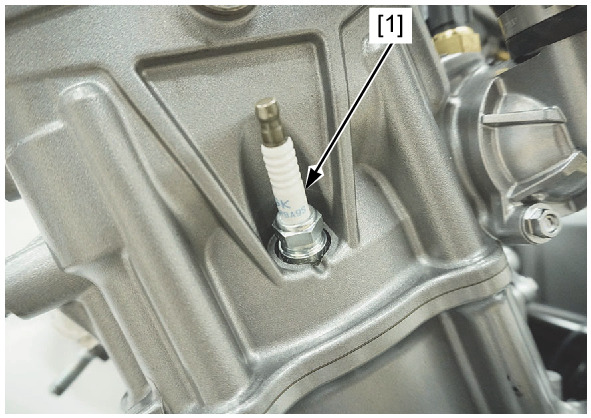
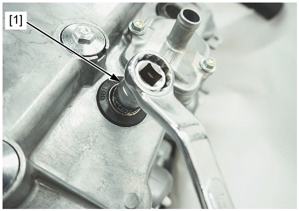

# Spark Plug

Источник: `Spark Plug.pdf`

REMOVAL/INSTALLATION 

NOTE: 
* Clean around the spark plug base with compressed air before removing the spark plug, and be sure that no debris is allowed to 
enter the combustion chamber. 
Remove the following: 
* Ignition coil tray 
* Radiator 
Remove the No.1-2 plug [1] using the equipped 
spark plug wrench. 
Remove the No.2-2 plug in the same manner. 

Remove the No.1-1 plug using the equipped spark 
plug wrench [1]. 
Remove the No.2-1 plug in the same manner. 
Inspect or replace the spark plugs as described in 
the MAINTENANCE SCHEDULE . 
Install and hand tighten the spark plug to the 
cylinder head, then tighten the spark plug to the 
specified torque using the spark plug wrench. 
TORQUE: 
Spark plug: 
22 N·m (2.2 kgf·m, 16 lbf·ft) 

NOTE: 
* Replace new spark plugs as a set. 
Install the following: 
* Radiator 
* Ignition coil tray 

