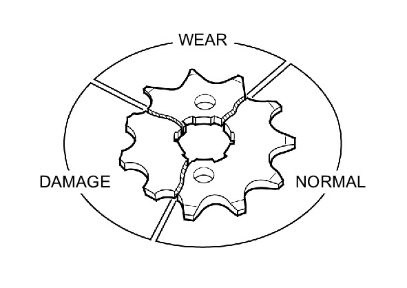
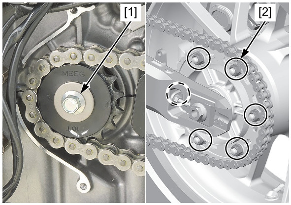

# Sprockets

Источник: `Sprockets.pdf`

SPROCKET INSPECTION 
Remove the left rear cover . 
Inspect the drive and driven sprocket teeth for wear or damage, replace if necessary. 
Never use a new drive chain on worn sprockets. 
Both chain and sprockets must be in good condition, or the replacement chain will wear rapidly. 
Check the drive sprocket bolt [1] and driven sprocket nuts [2] on the drive and driven sprockets. 
If any are loose, torque them. 
TORQUE: 
Drive sprocket bolt: 
54 N·m (5.5 kgf·m, 40 lbf·ft) 
Driven sprocket nut: 
64 N·m (6.5 kgf·m, 47 lbf·ft) 
Install the left rear cover . 

