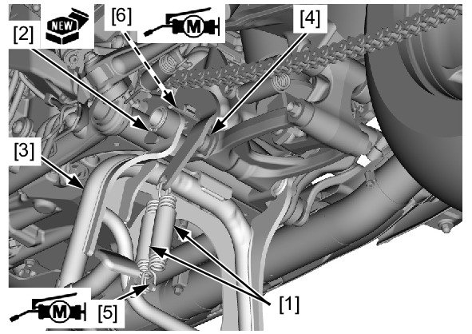

# Stand-Centre

Источник: `Stand-Centre.pdf`

REMOVAL/INSTALLATION 
Support the motorcycle securely using a hoist or 
equivalent. 
Remove the mainstand return springs [1]. 
Remove the circlip [2]. 
Remove the mainstand [3] by its sliding to the right 
side from the frame [4]. 
Installation is in the reverse order of removal. 

NOTE: 
* Apply the molybdenum disulfide grease to the 
contact area of the spring plate [5], main 
stand spring plate [6] and frame. 
* Refer to the Cable and Harness Routing for 
the mainstand return spring installation 
direction . 
* Replace the circlip with a new one. 

