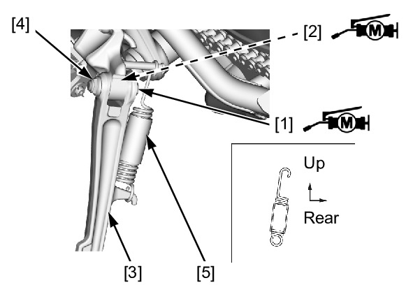
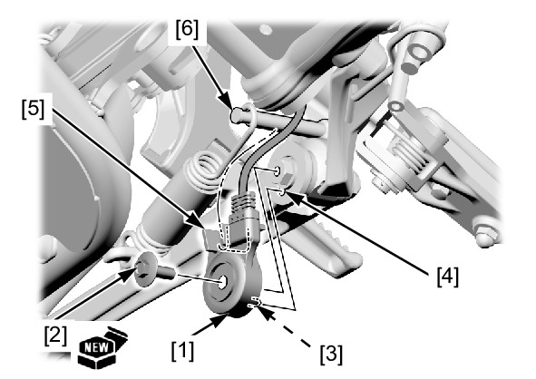

# Stand-Side Install

Источник: `Stand-Side Install.pdf`

INSTALLATION 
Apply molybdenum disulfide 
grease to the sidestand pivot bolt 
[1] sliding surface and collar [2] 
outer surface. 
Install the sidestand [3] and 
collar. 
Install and tighten the sidestand 
pivot bolt to the specified torque. 
TORQUE: 10 N·m (1.0 kgf·m, 7 
lbf·ft) 
After tightening the pivot bolt, 
return the pivot bolt 45° to 90°. 
Install and tighten the sidestand 
pivot nut [4] to the specified 
torque while holding the 
sidestand pivot bolt. 
TORQUE: 42 N·m (4.3 kgf·m, 
31 lbf·ft) 
Install the sidestand return spring 
[5] in the direction as shown. 

Install the sidestand switch [1] 
and new sidestand switch bolt 
[2]. 
Tighten the sidestand switch bolt 
to the specified torque. 
TORQUE: 10 N·m (1.0 kgf·m, 7 
lbf·ft) 

NOTE: 
* Align the sidestand switch 
tab [3] with the sidestand 
hole [4]. 
* Align the sidestand switch 
groove [5] with the return 
spring holding pin [6]. 
* Replace the sidestand 
switch bolt with a new one. 

