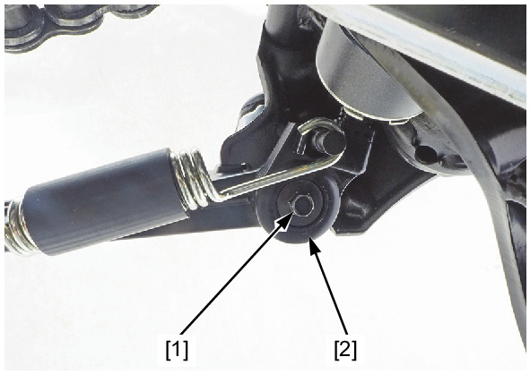
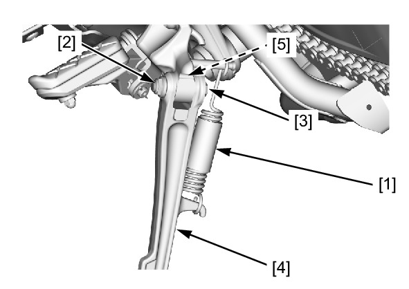

# Stand-Side Remove

Источник: `Stand-Side Remove.pdf`

REMOVAL 
Remove the sidestand 
switch bolt [1] and 
sidestand switch [2]. 

Support the motorcycle 
securely using a 
Mainstand, hoist or 
equivalent. 
Remove the sidestand 
return spring [1]. 
Remove the sidestand 
pivot nut [2] and bolt 
[3], then remove the 
sidestand [4] and collar 
[5]. 

