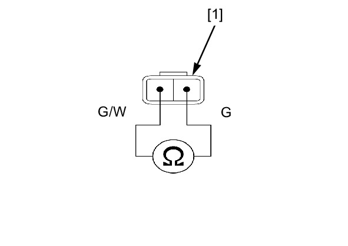

# Stand-Side Switch Inspection

Источник: `Stand-Side Switch Inspection.pdf`

INSPECTION 
Disconnect the sidestand switch 2P (Black) 
connector . 
Check for continuity at the switch side 2P (Black) 
connector [1] terminals. 
CONNECTION: Green/white – Green 
There should be continuity with the sidestand 
retracted and no continuity with the sidestand 
lowered. 

