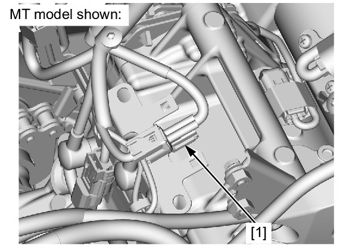
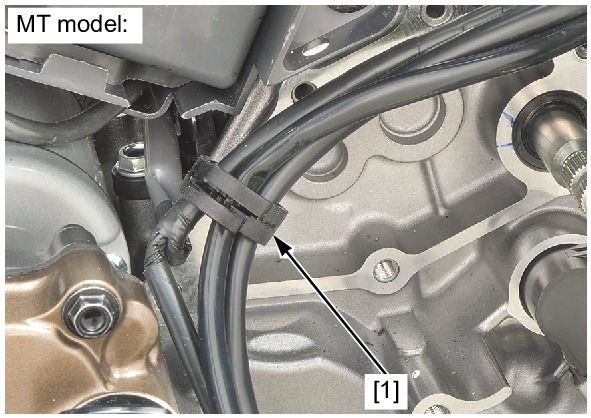
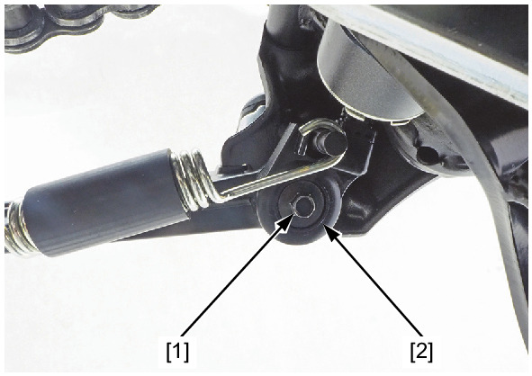
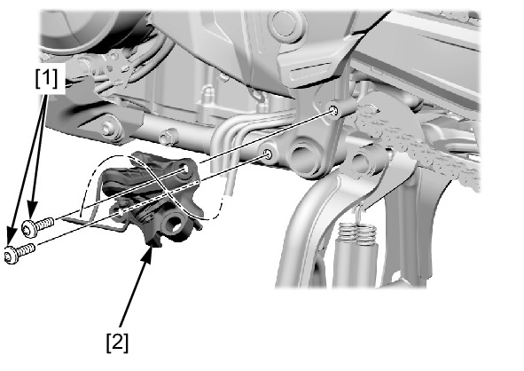
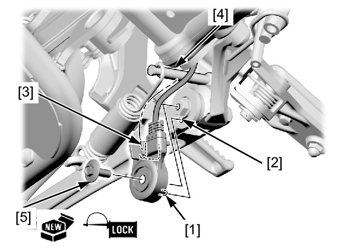

# Stand-Side Switch

Источник: `Stand-Side Switch.pdf`

REMOVAL/INSTALLATION 
Remove the shift spindle cover . 
! MT model: 
Remove the following: 
! DCT model: 
* Left rear cover 
* Shift control motor cover 
Disconnect the sidestand switch 2P (Black) connector [1]. 
Remove the clamp [1]. 
! MT model: 

Remove the sidestand switch bolt [1] and sidestand switch [2]. 
Remove the left main step bracket bolts [1] and left main step bracket [2]. 

Installation is in the reverse order of removal. 
TORQUE: 
Left main step bracket bolt: 
35 N·m (3.6 kgf·m, 26 lbf·ft) 
Sidestand switch bolt: 
10 N·m (1.0 kgf·m, 7 lbf·ft) 

NOTE: 
* Route the wires properly . 
* Align the sidestand switch tab [1] with the sidestand hole [2]. 
* Align the sidestand switch groove [3] with the return spring holding pin [4]. 
* Apply locking agent to the sidestand switch bolt [5] threads. 
* Replace the sidestand switch bolt with a new one. 

