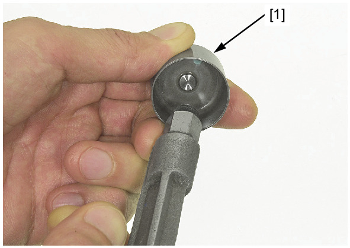
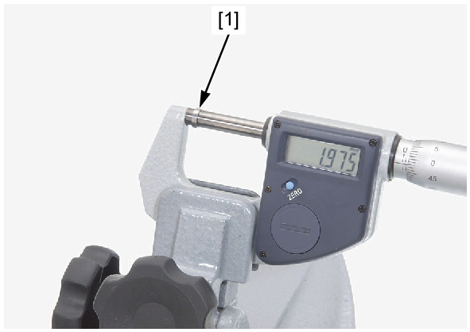
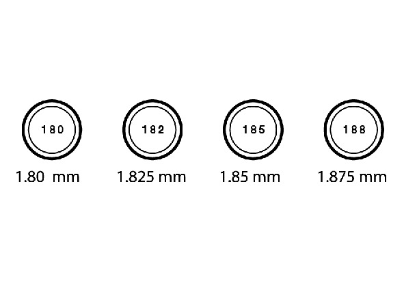

# Valve Clearance - Intake

Источник: `Valve Clearance - Intake.pdf`

INTAKE VALVE CLEARANCE ADJUSTMENT 
Remove the valve lifter and shim . 
Clean the valve shim contact area in the valve lifter [1] with compressed air. 
Measure the shim [1] thickness and record it. 

NOTE: 
* Fifty-one different shim thicknesses are available in increments of 0.025 mm (from 1.200 mm to 2.450 
mm). 

Calculate the new shim thickness using the equation below. 
A = (B – C) + D 
A: New shim thickness 
B: Recorded valve clearance 
C: Specified valve clearance 
D: Old shim thickness 

NOTE: 
* Make sure of the correct shim thickness by measuring the shim with the micrometer. 
* Reface the valve seat if carbon deposits result in a calculated dimension of over 2.450 mm. 
Install newly selected shims on the valve retainers. 
Install the valve lifter and camshaft . 
Rotate the crankshaft counterclockwise several times and recheck the valve clearances. 

