# Valve Clearance

Источник: `Valve Clearance.pdf`

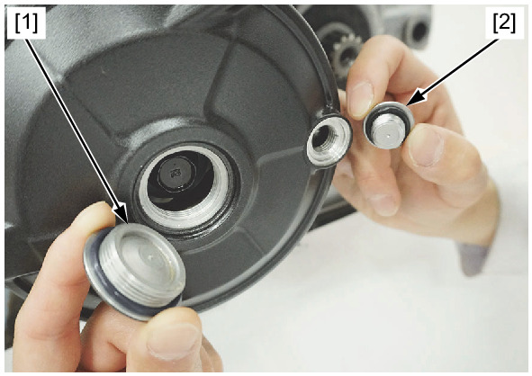

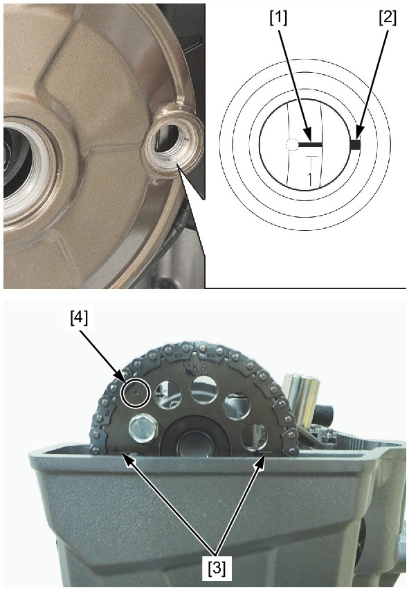

VALVE CLEARANCE 

NOTE: 
* Inspect and adjust the valve clearance while the engine is cold (below 35°/95°F). 
Remove the cylinder head cover . 
Remove the crankshaft hole cap [1] and the timing hole cap [2]. 
Turn the crankshaft counterclockwise and align the "T1" mark [1] on the flywheel with the index mark [2] of the alternator cover. 
Make sure that the index lines [3] on the cam sprocket align with the upper surface of the cylinder head and the punch mark [4] 
on the sprocket is visible. 
If the punch mark is not visible, rotate the crankshaft counterclockwise on full turn and realign the "T1" mark with the index mark. 

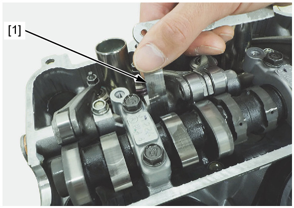

Check the No.1 cylinder intake valve clearances by inserting a feeler gauge [1] between the valve lifter and cam lobe. 
VALVE CLEARANCE: 
IN: 0.16 ± 0.03 mm (0.006 ± 0.001 in) 
Adjust the valve clearance by changing the valve lifter shim . 

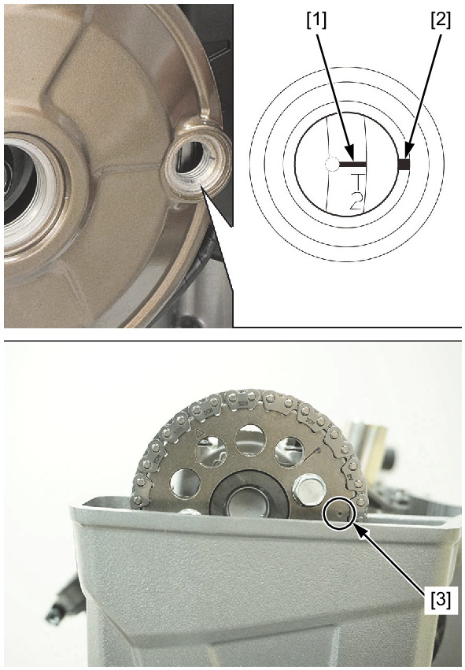

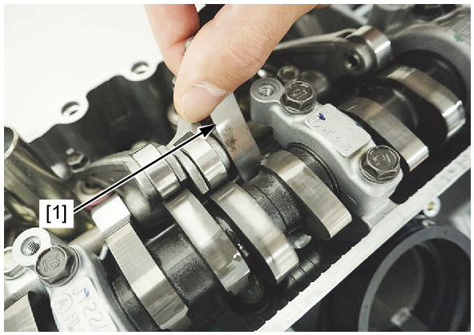

Turn the crankshaft counterclockwise 270° and align the "T2" mark [1] on the flywheel with the index mark [2] of the alternator 
cover. 
Make sure that the punch mark [3] on the cam sprocket aligns with the upper surface of the cylinder head as shown. 
Check the No.2 cylinder intake valve clearances by inserting a feeler gauge [1] between the valve lifter and cam lobe. 
VALVE CLEARANCE: 
IN: 0.16 ± 0.03 mm (0.006 ± 0.001 in) 
Adjust the valve clearance by changing the valve lifter shim . 

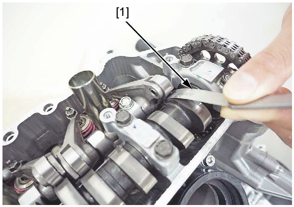

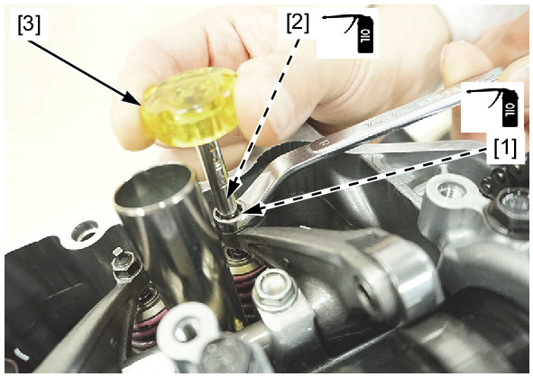

Check the No.2 cylinder exhaust valve clearances by inserting a feeler gauge [1] between the rocker arm roller and cam lobe. 
VALVE CLEARANCE: 
EX: 0.23 ± 0.02 mm (0.009 ± 0.001 in) 
Adjust the No.2 cylinder exhaust valve clearance by loosening the lock nut [1] and turning the adjusting screw [2] until there is a 
slight drag on the feeler gauge. 
TOOL: 
Tappet adjusting wrench [3] 07708-0030400 
Apply engine oil to the adjusting screw and lock nut threads and seating surface. 
Hold the adjusting screw and tighten the lock nut. 
TORQUE: 10 N·m (1.0 kgf·m, 7 lbf·ft) 

After tightening the lock nut, recheck the valve clearance. 
Rotate the crankshaft counterclockwise approximately 252.5° and align the "E1" mark [1] with the index mark [2]. 
Make sure that the " 
 " mark [3] on the cam sprocket align with the upper surface of the cylinder head as shown. 

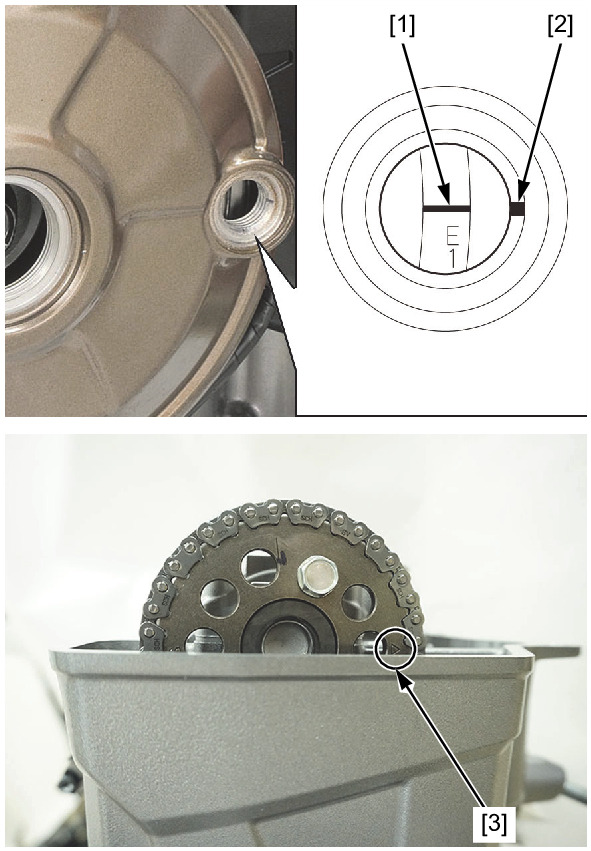

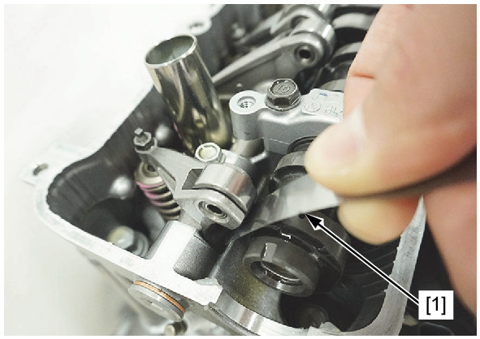

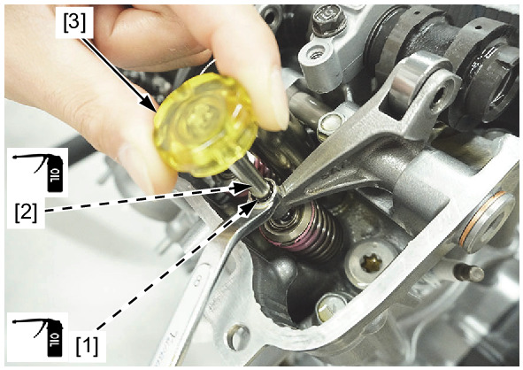

Check the No.1 cylinder exhaust valve clearances by inserting a feeler gauge [1] between the locker arm roller and cam lobe. 
VALVE CLEARANCE: 
EX: 0.23 ± 0.02 mm (0.009 ± 0.001 in) 
Adjust the No.1 cylinder exhaust valve clearance by loosening the lock nut [1] and turning the adjusting screw [2] until there is a 
slight drag on the feeler gauge. 
TOOL: 
Tappet adjusting wrench [3] 07708-0030400 
Apply engine oil to the adjusting screw and lock nut threads and seating surface. 
Hold the adjusting screw and tighten the lock nut. 
TORQUE: 10 N·m (1.0 kgf·m, 7 lbf·ft) 
After tightening the lock nut, recheck the valve clearance. 

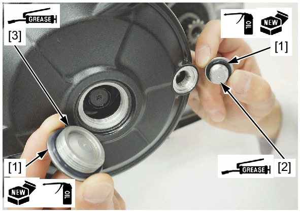

Coat new O-rings [1] with engine oil and install them into the timing hole cap [2] and crankshaft hole cap [3]. 
Apply grease to the threads of the timing hole and crankshaft hole caps. 
Install the timing hole and crankshaft hole caps, and tighten them. 
TORQUE: 
Timing hole cap: 
6.0 N·m (0.61 kgf·m, 4.4 lbf·ft) 
Crankshaft hole cap: 
8.0 N·m (0.82 kgf·m, 5.9 lbf·ft) 
Install the cylinder head cover . 
1.
INTAKE VALVE CLEARANCE ADJUSTMENT 

