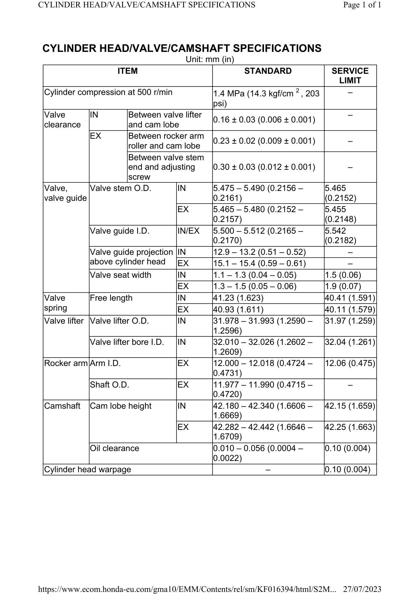

# Valve Specifications

Источник: `Valve Specifications.pdf`

CYLINDER HEAD/VALVE/CAMSHAFT SPECIFICATIONS 
Unit: mm (in) 
ITEM 
STANDARD 
SERVICE 
LIMIT 
Cylinder compression at 500 r/min 
1.4 MPa (14.3 kgf/cm 2 , 203 
psi) 
– 
Valve 
clearance 
IN 
Between valve lifter 
and cam lobe 
0.16 ± 0.03 (0.006 ± 0.001) 
– 
EX 
Between rocker arm 
roller and cam lobe 
0.23 ± 0.02 (0.009 ± 0.001) 
– 
Between valve stem 
end and adjusting 
screw 
0.30 ± 0.03 (0.012 ± 0.001) 
– 
Valve, 
valve guide 
Valve stem O.D. 
IN 
5.475 – 5.490 (0.2156 – 
0.2161) 
5.465 
(0.2152) 
EX 
5.465 – 5.480 (0.2152 – 
0.2157) 
5.455 
(0.2148) 
Valve guide I.D. 
IN/EX 
5.500 – 5.512 (0.2165 – 
0.2170) 
5.542 
(0.2182) 
Valve guide projection 
above cylinder head 
IN 
12.9 – 13.2 (0.51 – 0.52) 
– 
EX 
15.1 – 15.4 (0.59 – 0.61) 
– 
Valve seat width 
IN 
1.1 – 1.3 (0.04 – 0.05) 
1.5 (0.06) 
EX 
1.3 – 1.5 (0.05 – 0.06) 
1.9 (0.07) 
Valve 
spring 
Free length 
IN 
41.23 (1.623) 
40.41 (1.591) 
EX 
40.93 (1.611) 
40.11 (1.579) 
Valve lifter Valve lifter O.D. 
IN 
31.978 – 31.993 (1.2590 – 
1.2596) 
31.97 (1.259) 
Valve lifter bore I.D. 
IN 
32.010 – 32.026 (1.2602 – 
1.2609) 
32.04 (1.261) 
Rocker arm Arm I.D. 
EX 
12.000 – 12.018 (0.4724 – 
0.4731) 
12.06 (0.475) 
Shaft O.D. 
EX 
11.977 – 11.990 (0.4715 – 
0.4720) 
– 
Camshaft 
Cam lobe height 
IN 
42.180 – 42.340 (1.6606 – 
1.6669) 
42.15 (1.659) 
EX 
42.282 – 42.442 (1.6646 – 
1.6709) 
42.25 (1.663) 
Oil clearance 
0.010 – 0.056 (0.0004 – 
0.0022) 
0.10 (0.004) 
Cylinder head warpage 
– 
0.10 (0.004) 

