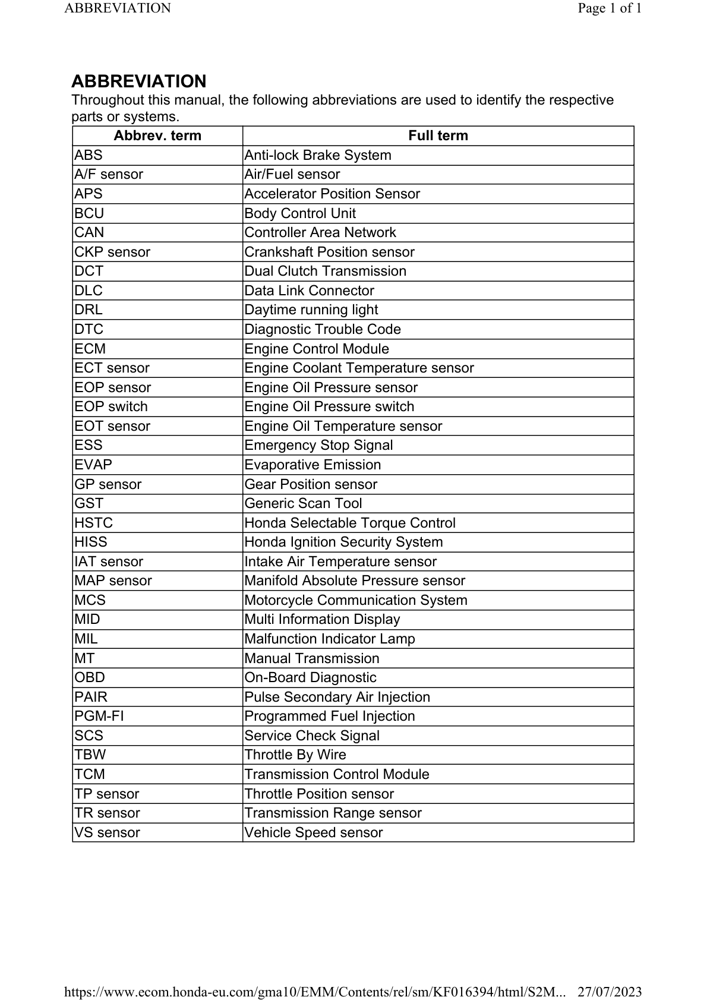

# WShop Manual - Abbreviations

Источник: `WShop Manual - Abbreviations.pdf`

ABBREVIATION 
Throughout this manual, the following abbreviations are used to identify the respective 
parts or systems. 
Abbrev. term 
Full term 
ABS 
Anti-lock Brake System 
A/F sensor 
Air/Fuel sensor 
APS 
Accelerator Position Sensor 
BCU 
Body Control Unit 
CAN 
Controller Area Network 
CKP sensor 
Crankshaft Position sensor 
DCT 
Dual Clutch Transmission 
DLC 
Data Link Connector 
DRL 
Daytime running light 
DTC 
Diagnostic Trouble Code 
ECM 
Engine Control Module 
ECT sensor 
Engine Coolant Temperature sensor 
EOP sensor 
Engine Oil Pressure sensor 
EOP switch 
Engine Oil Pressure switch 
EOT sensor 
Engine Oil Temperature sensor 
ESS 
Emergency Stop Signal 
EVAP 
Evaporative Emission 
GP sensor 
Gear Position sensor 
GST 
Generic Scan Tool 
HSTC 
Honda Selectable Torque Control 
HISS 
Honda Ignition Security System 
IAT sensor 
Intake Air Temperature sensor 
MAP sensor 
Manifold Absolute Pressure sensor 
MCS 
Motorcycle Communication System 
MID 
Multi Information Display 
MIL 
Malfunction Indicator Lamp 
MT 
Manual Transmission 
OBD 
On-Board Diagnostic 
PAIR 
Pulse Secondary Air Injection 
PGM-FI 
Programmed Fuel Injection 
SCS 
Service Check Signal 
TBW 
Throttle By Wire 
TCM 
Transmission Control Module 
TP sensor 
Throttle Position sensor 
TR sensor 
Transmission Range sensor 
VS sensor 
Vehicle Speed sensor 

