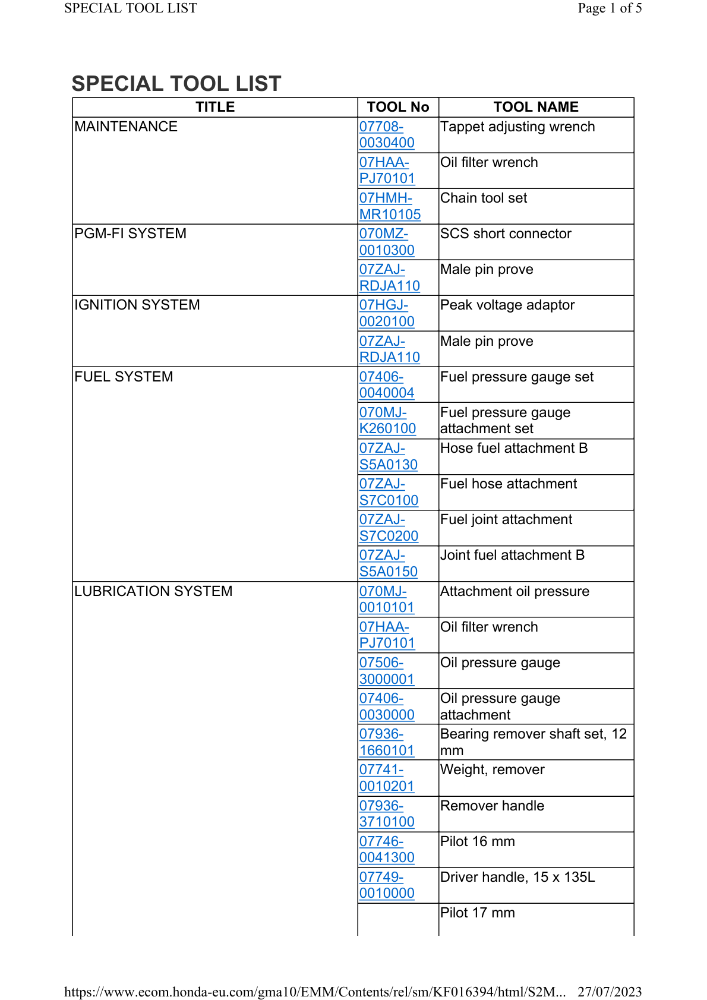
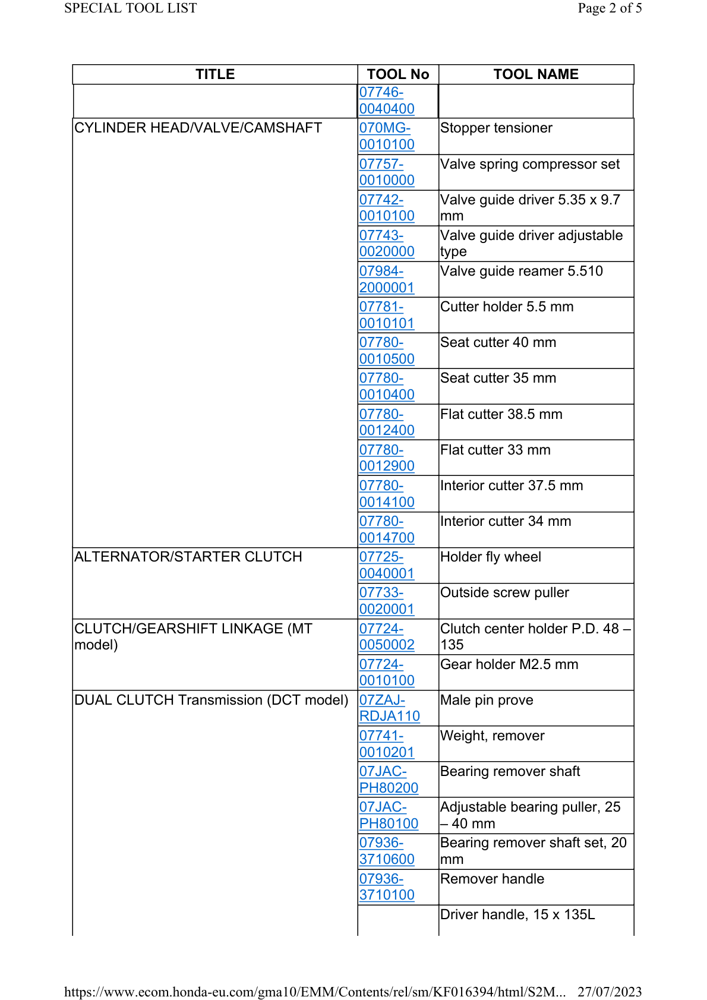
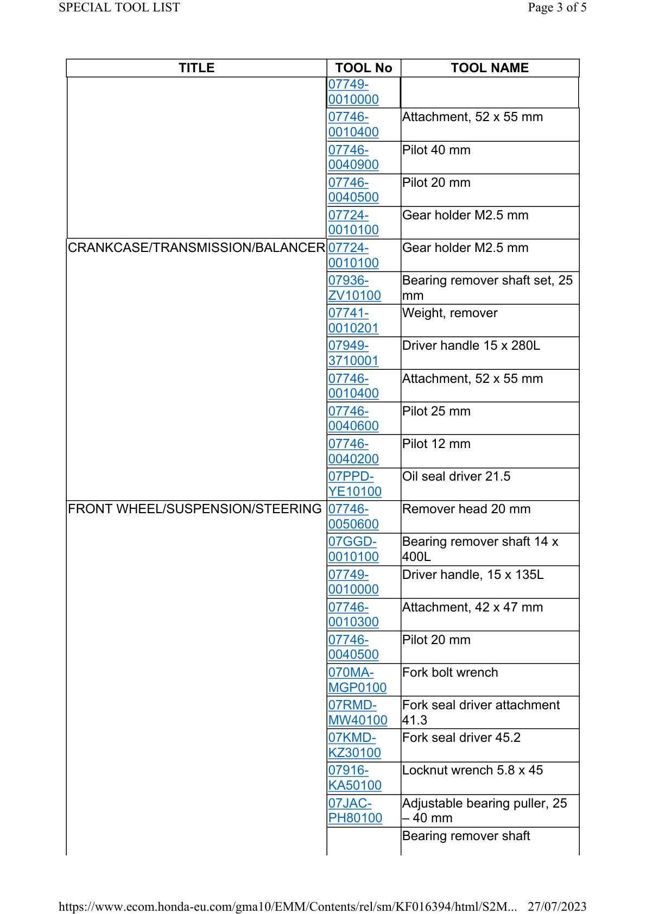
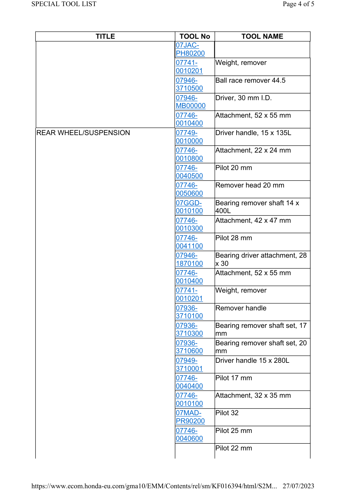
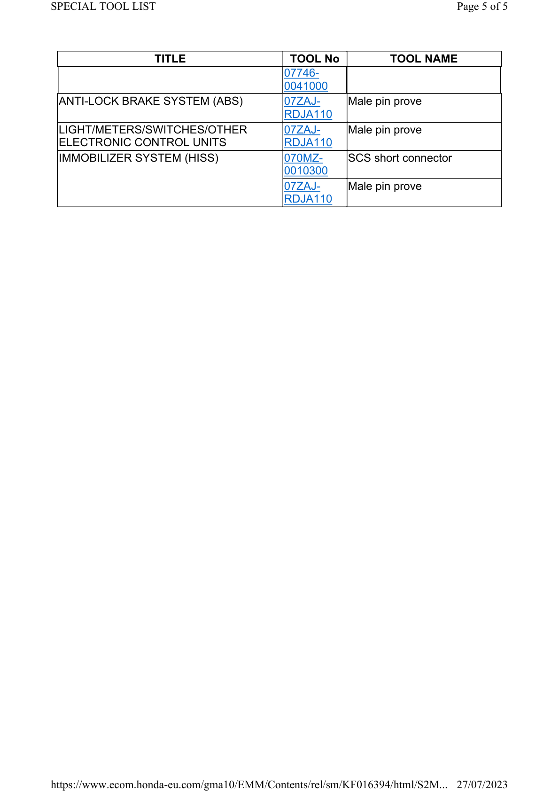

# WShop Manual - Special Tools

Источник: `WShop Manual - Special Tools.pdf`

SPECIAL TOOL LIST 
TITLE 
TOOL No 
TOOL NAME 
MAINTENANCE 
07708-
0030400 
Tappet adjusting wrench 
07HAA-
PJ70101 
Oil filter wrench 
07HMH-
MR10105 
Chain tool set 
PGM-FI SYSTEM 
070MZ-
0010300 
SCS short connector 
07ZAJ-
RDJA110 
Male pin prove 
IGNITION SYSTEM 
07HGJ-
0020100 
Peak voltage adaptor 
07ZAJ-
RDJA110 
Male pin prove 
FUEL SYSTEM 
07406-
0040004 
Fuel pressure gauge set 
070MJ-
K260100 
Fuel pressure gauge 
attachment set 
07ZAJ-
S5A0130 
Hose fuel attachment B 
07ZAJ-
S7C0100 
Fuel hose attachment 
07ZAJ-
S7C0200 
Fuel joint attachment 
07ZAJ-
S5A0150 
Joint fuel attachment B 
LUBRICATION SYSTEM 
070MJ-
0010101 
Attachment oil pressure 
07HAA-
PJ70101 
Oil filter wrench 
07506-
3000001 
Oil pressure gauge 
07406-
0030000 
Oil pressure gauge 
attachment 
07936-
1660101 
Bearing remover shaft set, 12 
mm 
07741-
0010201 
Weight, remover 
07936-
3710100 
Remover handle 
07746-
0041300 
Pilot 16 mm 
07749-
0010000 
Driver handle, 15 x 135L 
Pilot 17 mm 

TITLE 
TOOL No 
TOOL NAME 
07746-
0040400 
CYLINDER HEAD/VALVE/CAMSHAFT 
070MG-
0010100 
Stopper tensioner 
07757-
0010000 
Valve spring compressor set 
07742-
0010100 
Valve guide driver 5.35 x 9.7 
mm 
07743-
0020000 
Valve guide driver adjustable 
type 
07984-
2000001 
Valve guide reamer 5.510 
07781-
0010101 
Cutter holder 5.5 mm 
07780-
0010500 
Seat cutter 40 mm 
07780-
0010400 
Seat cutter 35 mm 
07780-
0012400 
Flat cutter 38.5 mm 
07780-
0012900 
Flat cutter 33 mm 
07780-
0014100 
Interior cutter 37.5 mm 
07780-
0014700 
Interior cutter 34 mm 
ALTERNATOR/STARTER CLUTCH 
07725-
0040001 
Holder fly wheel 
07733-
0020001 
Outside screw puller 
CLUTCH/GEARSHIFT LINKAGE (MT 
model) 
07724-
0050002 
Clutch center holder P.D. 48 – 
135 
07724-
0010100 
Gear holder M2.5 mm 
DUAL CLUTCH Transmission (DCT model) 07ZAJ-
RDJA110 
Male pin prove 
07741-
0010201 
Weight, remover 
07JAC-
PH80200 
Bearing remover shaft 
07JAC-
PH80100 
Adjustable bearing puller, 25 
– 40 mm 
07936-
3710600 
Bearing remover shaft set, 20 
mm 
07936-
3710100 
Remover handle 
Driver handle, 15 x 135L 

TITLE 
TOOL No 
TOOL NAME 
07749-
0010000 
07746-
0010400 
Attachment, 52 x 55 mm 
07746-
0040900 
Pilot 40 mm 
07746-
0040500 
Pilot 20 mm 
07724-
0010100 
Gear holder M2.5 mm 
CRANKCASE/TRANSMISSION/BALANCER 07724-
0010100 
Gear holder M2.5 mm 
07936-
ZV10100 
Bearing remover shaft set, 25 
mm 
07741-
0010201 
Weight, remover 
07949-
3710001 
Driver handle 15 x 280L 
07746-
0010400 
Attachment, 52 x 55 mm 
07746-
0040600 
Pilot 25 mm 
07746-
0040200 
Pilot 12 mm 
07PPD-
YE10100 
Oil seal driver 21.5 
FRONT WHEEL/SUSPENSION/STEERING 07746-
0050600 
Remover head 20 mm 
07GGD-
0010100 
Bearing remover shaft 14 x 
400L 
07749-
0010000 
Driver handle, 15 x 135L 
07746-
0010300 
Attachment, 42 x 47 mm 
07746-
0040500 
Pilot 20 mm 
070MA-
MGP0100 
Fork bolt wrench 
07RMD-
MW40100 
Fork seal driver attachment 
41.3 
07KMD-
KZ30100 
Fork seal driver 45.2 
07916-
KA50100 
Locknut wrench 5.8 x 45 
07JAC-
PH80100 
Adjustable bearing puller, 25 
– 40 mm 
Bearing remover shaft 

TITLE 
TOOL No 
TOOL NAME 
07JAC-
PH80200 
07741-
0010201 
Weight, remover 
07946-
3710500 
Ball race remover 44.5 
07946-
MB00000 
Driver, 30 mm I.D. 
07746-
0010400 
Attachment, 52 x 55 mm 
REAR WHEEL/SUSPENSION 
07749-
0010000 
Driver handle, 15 x 135L 
07746-
0010800 
Attachment, 22 x 24 mm 
07746-
0040500 
Pilot 20 mm 
07746-
0050600 
Remover head 20 mm 
07GGD-
0010100 
Bearing remover shaft 14 x 
400L 
07746-
0010300 
Attachment, 42 x 47 mm 
07746-
0041100 
Pilot 28 mm 
07946-
1870100 
Bearing driver attachment, 28 
x 30 
07746-
0010400 
Attachment, 52 x 55 mm 
07741-
0010201 
Weight, remover 
07936-
3710100 
Remover handle 
07936-
3710300 
Bearing remover shaft set, 17 
mm 
07936-
3710600 
Bearing remover shaft set, 20 
mm 
07949-
3710001 
Driver handle 15 x 280L 
07746-
0040400 
Pilot 17 mm 
07746-
0010100 
Attachment, 32 x 35 mm 
07MAD-
PR90200 
Pilot 32 
07746-
0040600 
Pilot 25 mm 
Pilot 22 mm 

TITLE 
TOOL No 
TOOL NAME 
07746-
0041000 
ANTI-LOCK BRAKE SYSTEM (ABS) 
07ZAJ-
RDJA110 
Male pin prove 
LIGHT/METERS/SWITCHES/OTHER 
ELECTRONIC CONTROL UNITS 
07ZAJ-
RDJA110 
Male pin prove 
IMMOBILIZER SYSTEM (HISS) 
070MZ-
0010300 
SCS short connector 
07ZAJ-
RDJA110 
Male pin prove 

