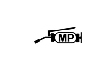

# WShop Manual - Symbols

Источник: `WShop Manual - Symbols.pdf`

SYMBOLS 
The symbols used throughout this manual show specific service procedures. If 
supplementary information is required pertaining to these symbols, it would be explained 
specifically in the text without the use of the symbols. 
Replace the part(s) with new one(s) before assembly. 
Use the recommend engine oil, unless otherwise 
specified. 
Use molybdenum oil solution (mixture of the engine oil 
and molybdenum grease in a ratio of 1:1). 
Use multi-purpose grease (lithium based multi-purpose 
grease NLGI #2 or equivalent). 
Use molybdenum disulfide grease (containing more than 
3% molybdenum disulfide, NLGI #2 or equivalent). 
Example: 
* Molykote® BR-2 plus manufactured by Dow Corning 
U.S.A. 
Use molybdenum disulfide paste (containing more than 
40% molybdenum disulfide, NLGI #2 or equivalent). 
Example: 
* Molykote® G-n Paste manufactured by Dow 
Corning U.S.A. 
* Pro Honda M-77 Assembly Paste (Moly) (U.S.A. 
only) 
* Rocol ASP manufactured by Rocol Limited, U.K. 
* Moly Paste 500 manufactured by Sumico Lubricant, 
Japan 
Use silicone grease. 
Apply a locking agent. Use a medium strength locking 
agent unless otherwise specified. 
Apply sealant. 
Use DOT 4 brake fluid. Use the recommended brake fluid 
unless otherwise specified. 

Use fork or suspension fluid. 

