# WShop Manual - Torque Values - Engine&Frame

Источник: `WShop Manual - Torque Values - Engine&Frame.pdf`

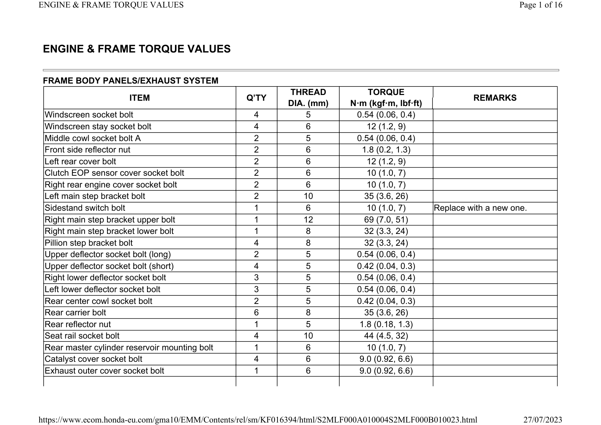

ENGINE & FRAME TORQUE VALUES 
FRAME BODY PANELS/EXHAUST SYSTEM 
ITEM 
Q’TY 
THREAD 
TORQUE 
REMARKS 
DIA. (mm) 
N·m (kgf·m, lbf·ft) 
Windscreen socket bolt 
4 
5 
0.54 (0.06, 0.4) 
Windscreen stay socket bolt 
4 
6 
12 (1.2, 9) 
Middle cowl socket bolt A 
2 
5 
0.54 (0.06, 0.4) 
Front side reflector nut 
2 
6 
1.8 (0.2, 1.3) 
Left rear cover bolt 
2 
6 
12 (1.2, 9) 
Clutch EOP sensor cover socket bolt 
2 
6 
10 (1.0, 7) 
Right rear engine cover socket bolt 
2 
6 
10 (1.0, 7) 
Left main step bracket bolt 
2 
10 
35 (3.6, 26) 
Sidestand switch bolt 
1 
6 
10 (1.0, 7) 
Replace with a new one. 
Right main step bracket upper bolt 
1 
12 
69 (7.0, 51) 
Right main step bracket lower bolt 
1 
8 
32 (3.3, 24) 
Pillion step bracket bolt 
4 
8 
32 (3.3, 24) 
Upper deflector socket bolt (long) 
2 
5 
0.54 (0.06, 0.4) 
Upper deflector socket bolt (short) 
4 
5 
0.42 (0.04, 0.3) 
Right lower deflector socket bolt 
3 
5 
0.54 (0.06, 0.4) 
Left lower deflector socket bolt 
3 
5 
0.54 (0.06, 0.4) 
Rear center cowl socket bolt 
2 
5 
0.42 (0.04, 0.3) 
Rear carrier bolt 
6 
8 
35 (3.6, 26) 
Rear reflector nut 
1 
5 
1.8 (0.18, 1.3) 
Seat rail socket bolt 
4 
10 
44 (4.5, 32) 
Rear master cylinder reservoir mounting bolt 
1 
6 
10 (1.0, 7) 
Catalyst cover socket bolt 
4 
6 
9.0 (0.92, 6.6) 
Exhaust outer cover socket bolt 
1 
6 
9.0 (0.92, 6.6) 

ITEM 
Q’TY 
THREAD 
TORQUE 
REMARKS 
DIA. (mm) 
N·m (kgf·m, lbf·ft) 
Exhaust pipe cover C socket bolt 
4 
6 
9.0 (0.92, 6.6) 
Muffler band bolt 
2 
8 
17 (1.7, 13) 
Muffler cover screw 
1 
6 
9.0 (0.92, 6.6) 
Tail cap cover bolt 
2 
6 
9.0 (0.92, 6.6) 
Exhaust pipe cover band screw 
2 
– 
2.8 (0.29, 2.1) 
Worm screw 
Exhaust pipe joint nut 
4 
8 
20 (2.0, 15) 
Exhaust pipe stud bolt 
4 
8 
– 
Sidestand pivot bolt 
1 
10 
10 (1.0, 7) 
Sidestand pivot nut 
1 
10 
42 (4.3, 31) 
Self lock nut 
MAINTENANCE 
ITEM 
Q’TY 
THREAD 
TORQUE 
REMARKS 
DIA. (mm) 
N·m (kgf·m, lbf·ft) 
Air cleaner element mounting screw 
4 
5 
1.1 (0.11, 0.8) 
Tapping screw 
Air cleaner cover screw 
6 
5 
1.1 (0.11, 0.8) 
Tapping screw 
Spark plug 
4 
10 
22 (2.2, 16) 
Valve adjusting screw lock nut 
4 
5 
10 (1.0, 7) 
Apply engine oil to the threads and 
seating surface. 
Timing hole cap 
1 
14 
6.0 (0.61, 4.4) 
Apply grease to the threads. 
Crankshaft hole cap 
1 
30 
8.0 (0.82, 5.9) 
Apply grease to the threads. 
Engine oil drain bolt 
2 
12 
30 (3.1, 22) 
Oil filter boss (crankcase side) 
1 
20 
– 
Apply locking agent to the threads. 
Engine oil filter cartridge 
1 
20 
26 (2.7, 19) 
Apply engine oil to the threads. 
Clutch oil filter cover bolt (DCT model) 
2 
6 
12 (1.2, 9) 
Rear axle nut 
1 
18 
100 (10.2, 74) 
Self-lock nut 
Drive chain adjuster lock nut 
2 
8 
27 (2.8, 20) 
UBS-nut 
Drive sprocket bolt 
1 
10 
54 (5.5, 40) 
Driven sprocket nut 
6 
10 
64 (6.5, 47) 
Self-lock nut 

ITEM 
Q’TY 
THREAD 
TORQUE 
REMARKS 
DIA. (mm) 
N·m (kgf·m, lbf·ft) 
Oil bolt 
5 
10 
34 (3.5, 25) 
Brake pipe joint nut 
4 
10 
14 (1.4, 10) 
Apply brake fluid to the threads. 
Parking brake adjuster lock nut (DCT 
model) 
1 
8 
17.2 (1.8, 13) 
PGM-FI SYSTEM 
ITEM 
Q’TY 
THREAD 
TORQUE 
REMARKS 
DIA. (mm) 
N·m (kgf·m, lbf·ft) 
A/F sensor 
2 
12 
24.5 (2.5, 18) 
MAP sensor screw/washer 
1 
6 
4.9 (0.50, 3.6) 
IAT sensor mounting screw 
2 
5 
1.1 (0.11, 0.8) 
ECT sensor 
1 
10 
12 (1.2, 9) 
GP sensor mounting bolt (MT model) 
1 
6 
12 (1.2, 9) 
Shift spindle switch 
1 
10 
12 (1.2, 9) 
Apply engine oil to the threads and 
seating surface. 
Shift spindle switch terminal nut 
1 
4 
1.7 (0.17, 1.3) 
CKP sensor bolt 
1 
6 
12 (1.2, 9) 
ELECTRIC STARTER 
ITEM 
Q’TY 
THREAD 
TORQUE 
REMARKS 
DIA. (mm) 
N·m (kgf·m, lbf·ft) 
Starter motor cable terminal nut/washer 
1 
6 
10 (1.0, 7) 
Starter motor setting bolt 
2 
5 
4.9 (0.50, 3.6) 
Negative brush screw/washer 
1 
5 
3.7 (0.38, 2.7) 
FUEL SYSTEM 
ITEM 
Q’TY 
THREAD 
TORQUE 
REMARKS 
DIA. (mm) 
N·m (kgf·m, lbf·ft) 
Fuel filler cap bolt 
3 
4 
1.8 (0.18, 1.3) 
Front cross plate bolt 
4 
6 
12 (1.2, 9) 
Fuel pump unit mounting nut 
5 
6 
12 (1.2, 9) 

ITEM 
Q’TY 
THREAD 
TORQUE 
REMARKS 
DIA. (mm) 
N·m (kgf·m, lbf·ft) 
Connecting hose band screw 
2 
4 
– 
Insulator band screw 
2 
5 
– 
Fuel injector assembly mounting bolt 
4 
5 
5.1 (0.52, 3.8) 
MAP sensor screw/washer 
1 
6 
4.9 (0.50, 3.6) 
PAIR reed valve cover bolt 
2 
6 
12 (1.2, 9) 
COOLING SYSTEM 
ITEM 
Q’TY 
THREAD 
TORQUE 
REMARKS 
DIA. (mm) 
N·m (kgf·m, lbf·ft) 
Coolant drain bolt 
1 
6 
13 (1.3, 10) 
Thermostat cover bolt 
2 
6 
12 (1.2, 9) 
Water hose band screw 
6 
– 
– 
Fan motor shroud bolt 
4 
6 
8.5 (0.87, 6.3) 
Cooling fan mounting nut 
2 
5 
2.7 (0.28, 2.0) 
Apply locking agent to the threads. 
Fan motor mounting screw 
6 
5 
2.7 (0.28, 2.0) 
Water pump cover bolt 
4 
6 
13 (1.3, 10) 
Apply locking agent to the threads. 
(*1) 
LUBRICATION SYSTEM 
ITEM 
Q’TY 
THREAD 
TORQUE 
REMARKS 
DIA. (mm) 
N·m (kgf·m, lbf·ft) 
Engine oil filter cartridge 
1 
20 
26 (2.7, 19) 
Apply engine oil to the threads. 
Oil pump mounting bolt 
3 
6 
16 (1.6, 12) 
Flange bolt 
6 
6 
12 (1.2, 9) 
Sealing bolt (22 mm) 
1 
22 
30 (3.1, 22) 
Apply locking agent to the threads. 
Sealing bolt (24 mm) (DCT model) 
1 
24 
30 (3.1, 22) 
Apply locking agent to the threads. 
Oil pump driven gear set plate bolt 
1 
6 
12 (1.2, 9) 
Apply locking agent to the threads. 
(*1) 
CYLINDER HEAD/VALVE/CAMSHAFT 

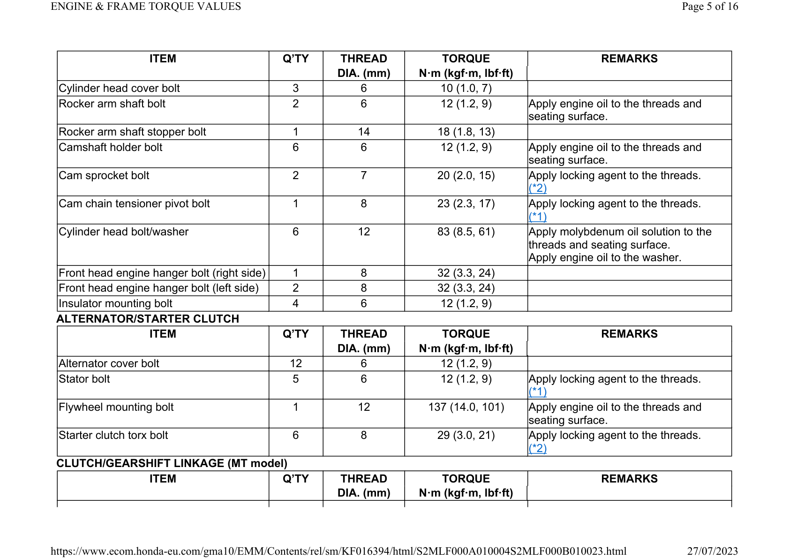

ITEM 
Q’TY 
THREAD 
TORQUE 
REMARKS 
DIA. (mm) 
N·m (kgf·m, lbf·ft) 
Cylinder head cover bolt 
3 
6 
10 (1.0, 7) 
Rocker arm shaft bolt 
2 
6 
12 (1.2, 9) 
Apply engine oil to the threads and 
seating surface. 
Rocker arm shaft stopper bolt 
1 
14 
18 (1.8, 13) 
Camshaft holder bolt 
6 
6 
12 (1.2, 9) 
Apply engine oil to the threads and 
seating surface. 
Cam sprocket bolt 
2 
7 
20 (2.0, 15) 
Apply locking agent to the threads. 
(*2) 
Cam chain tensioner pivot bolt 
1 
8 
23 (2.3, 17) 
Apply locking agent to the threads. 
(*1) 
Cylinder head bolt/washer 
6 
12 
83 (8.5, 61) 
Apply molybdenum oil solution to the 
threads and seating surface. 
Apply engine oil to the washer. 
Front head engine hanger bolt (right side) 
1 
8 
32 (3.3, 24) 
Front head engine hanger bolt (left side) 
2 
8 
32 (3.3, 24) 
Insulator mounting bolt 
4 
6 
12 (1.2, 9) 
ALTERNATOR/STARTER CLUTCH 
ITEM 
Q’TY 
THREAD 
TORQUE 
REMARKS 
DIA. (mm) 
N·m (kgf·m, lbf·ft) 
Alternator cover bolt 
12 
6 
12 (1.2, 9) 
Stator bolt 
5 
6 
12 (1.2, 9) 
Apply locking agent to the threads. 
(*1) 
Flywheel mounting bolt 
1 
12 
137 (14.0, 101) 
Apply engine oil to the threads and 
seating surface. 
Starter clutch torx bolt 
6 
8 
29 (3.0, 21) 
Apply locking agent to the threads. 
(*2) 
CLUTCH/GEARSHIFT LINKAGE (MT model) 
ITEM 
Q’TY 
THREAD 
TORQUE 
REMARKS 
DIA. (mm) 
N·m (kgf·m, lbf·ft) 

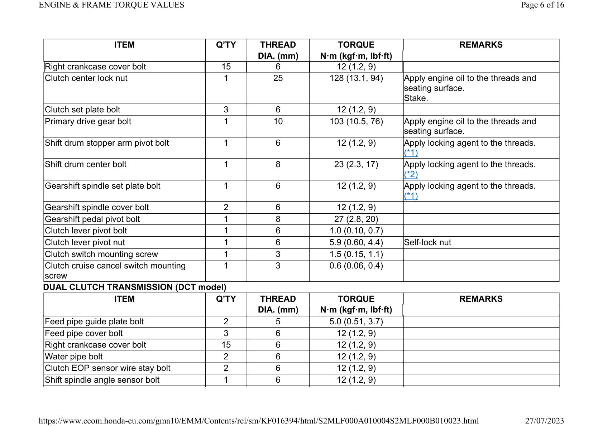

ITEM 
Q’TY 
THREAD 
TORQUE 
REMARKS 
DIA. (mm) 
N·m (kgf·m, lbf·ft) 
Right crankcase cover bolt 
15 
6 
12 (1.2, 9) 
Clutch center lock nut 
1 
25 
128 (13.1, 94) 
Apply engine oil to the threads and 
seating surface. 
Stake. 
Clutch set plate bolt 
3 
6 
12 (1.2, 9) 
Primary drive gear bolt 
1 
10 
103 (10.5, 76) 
Apply engine oil to the threads and 
seating surface. 
Shift drum stopper arm pivot bolt 
1 
6 
12 (1.2, 9) 
Apply locking agent to the threads. 
(*1) 
Shift drum center bolt 
1 
8 
23 (2.3, 17) 
Apply locking agent to the threads. 
(*2) 
Gearshift spindle set plate bolt 
1 
6 
12 (1.2, 9) 
Apply locking agent to the threads. 
(*1) 
Gearshift spindle cover bolt 
2 
6 
12 (1.2, 9) 
Gearshift pedal pivot bolt 
1 
8 
27 (2.8, 20) 
Clutch lever pivot bolt 
1 
6 
1.0 (0.10, 0.7) 
Clutch lever pivot nut 
1 
6 
5.9 (0.60, 4.4) 
Self-lock nut 
Clutch switch mounting screw 
1 
3 
1.5 (0.15, 1.1) 
Clutch cruise cancel switch mounting 
screw 
1 
3 
0.6 (0.06, 0.4) 
DUAL CLUTCH TRANSMISSION (DCT model) 
ITEM 
Q’TY 
THREAD 
TORQUE 
REMARKS 
DIA. (mm) 
N·m (kgf·m, lbf·ft) 
Feed pipe guide plate bolt 
2 
5 
5.0 (0.51, 3.7) 
Feed pipe cover bolt 
3 
6 
12 (1.2, 9) 
Right crankcase cover bolt 
15 
6 
12 (1.2, 9) 
Water pipe bolt 
2 
6 
12 (1.2, 9) 
Clutch EOP sensor wire stay bolt 
2 
6 
12 (1.2, 9) 
Shift spindle angle sensor bolt 
1 
6 
12 (1.2, 9) 

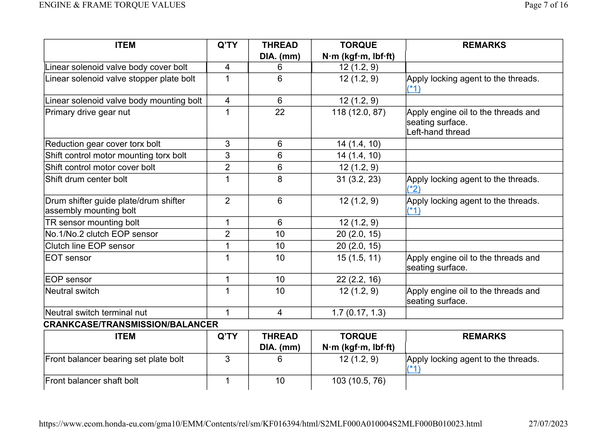

ITEM 
Q’TY 
THREAD 
TORQUE 
REMARKS 
DIA. (mm) 
N·m (kgf·m, lbf·ft) 
Linear solenoid valve body cover bolt 
4 
6 
12 (1.2, 9) 
Linear solenoid valve stopper plate bolt 
1 
6 
12 (1.2, 9) 
Apply locking agent to the threads. 
(*1) 
Linear solenoid valve body mounting bolt 
4 
6 
12 (1.2, 9) 
Primary drive gear nut 
1 
22 
118 (12.0, 87) 
Apply engine oil to the threads and 
seating surface. 
Left-hand thread 
Reduction gear cover torx bolt 
3 
6 
14 (1.4, 10) 
Shift control motor mounting torx bolt 
3 
6 
14 (1.4, 10) 
Shift control motor cover bolt 
2 
6 
12 (1.2, 9) 
Shift drum center bolt 
1 
8 
31 (3.2, 23) 
Apply locking agent to the threads. 
(*2) 
Drum shifter guide plate/drum shifter 
assembly mounting bolt 
2 
6 
12 (1.2, 9) 
Apply locking agent to the threads. 
(*1) 
TR sensor mounting bolt 
1 
6 
12 (1.2, 9) 
No.1/No.2 clutch EOP sensor 
2 
10 
20 (2.0, 15) 
Clutch line EOP sensor 
1 
10 
20 (2.0, 15) 
EOT sensor 
1 
10 
15 (1.5, 11) 
Apply engine oil to the threads and 
seating surface. 
EOP sensor 
1 
10 
22 (2.2, 16) 
Neutral switch 
1 
10 
12 (1.2, 9) 
Apply engine oil to the threads and 
seating surface. 
Neutral switch terminal nut 
1 
4 
1.7 (0.17, 1.3) 
CRANKCASE/TRANSMISSION/BALANCER 
ITEM 
Q’TY 
THREAD 
TORQUE 
REMARKS 
DIA. (mm) 
N·m (kgf·m, lbf·ft) 
Front balancer bearing set plate bolt 
3 
6 
12 (1.2, 9) 
Apply locking agent to the threads. 
(*1) 
Front balancer shaft bolt 
1 
10 
103 (10.5, 76) 

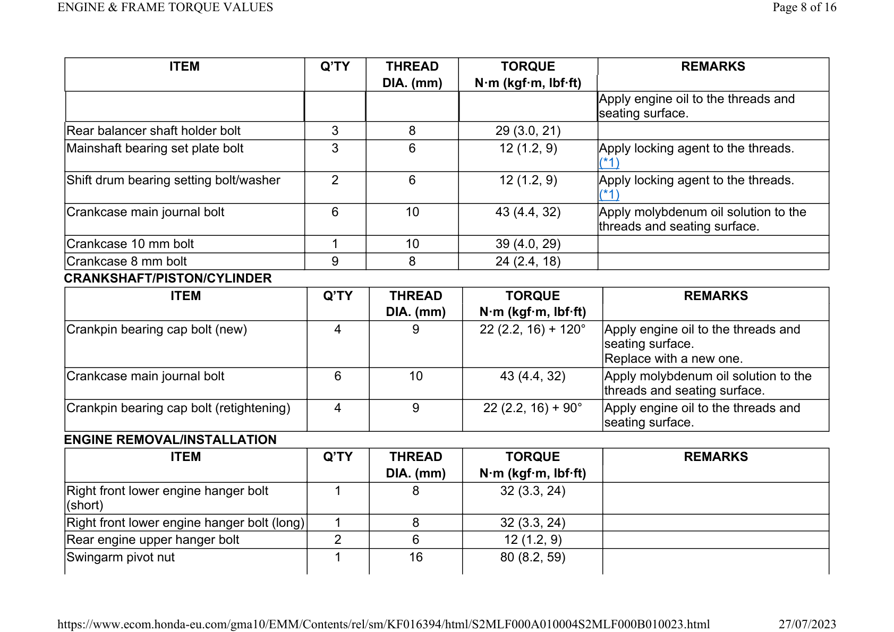

ITEM 
Q’TY 
THREAD 
TORQUE 
REMARKS 
DIA. (mm) 
N·m (kgf·m, lbf·ft) 
Apply engine oil to the threads and 
seating surface. 
Rear balancer shaft holder bolt 
3 
8 
29 (3.0, 21) 
Mainshaft bearing set plate bolt 
3 
6 
12 (1.2, 9) 
Apply locking agent to the threads. 
(*1) 
Shift drum bearing setting bolt/washer 
2 
6 
12 (1.2, 9) 
Apply locking agent to the threads. 
(*1) 
Crankcase main journal bolt 
6 
10 
43 (4.4, 32) 
Apply molybdenum oil solution to the 
threads and seating surface. 
Crankcase 10 mm bolt 
1 
10 
39 (4.0, 29) 
Crankcase 8 mm bolt 
9 
8 
24 (2.4, 18) 
CRANKSHAFT/PISTON/CYLINDER 
ITEM 
Q’TY 
THREAD 
TORQUE 
REMARKS 
DIA. (mm) 
N·m (kgf·m, lbf·ft) 
Crankpin bearing cap bolt (new) 
4 
9 
22 (2.2, 16) + 120° 
Apply engine oil to the threads and 
seating surface. 
Replace with a new one. 
Crankcase main journal bolt 
6 
10 
43 (4.4, 32) 
Apply molybdenum oil solution to the 
threads and seating surface. 
Crankpin bearing cap bolt (retightening) 
4 
9 
22 (2.2, 16) + 90° 
Apply engine oil to the threads and 
seating surface. 
ENGINE REMOVAL/INSTALLATION 
ITEM 
Q’TY 
THREAD 
TORQUE 
REMARKS 
DIA. (mm) 
N·m (kgf·m, lbf·ft) 
Right front lower engine hanger bolt 
(short) 
1 
8 
32 (3.3, 24) 
Right front lower engine hanger bolt (long) 
1 
8 
32 (3.3, 24) 
Rear engine upper hanger bolt 
2 
6 
12 (1.2, 9) 
Swingarm pivot nut 
1 
16 
80 (8.2, 59) 

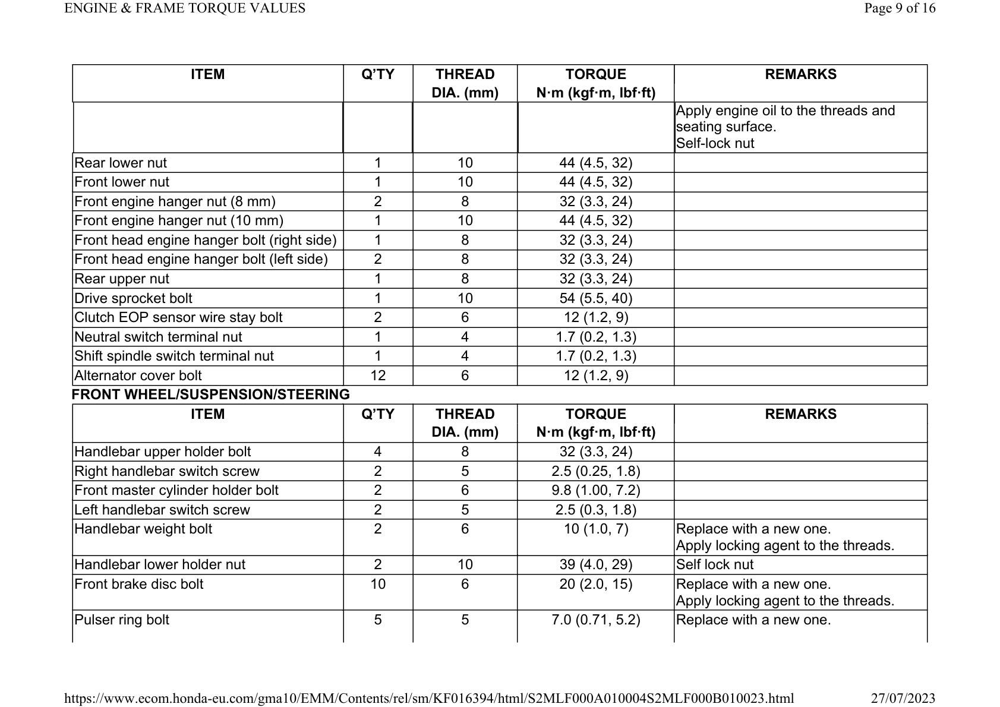

ITEM 
Q’TY 
THREAD 
TORQUE 
REMARKS 
DIA. (mm) 
N·m (kgf·m, lbf·ft) 
Apply engine oil to the threads and 
seating surface. 
Self-lock nut 
Rear lower nut 
1 
10 
44 (4.5, 32) 
Front lower nut 
1 
10 
44 (4.5, 32) 
Front engine hanger nut (8 mm) 
2 
8 
32 (3.3, 24) 
Front engine hanger nut (10 mm) 
1 
10 
44 (4.5, 32) 
Front head engine hanger bolt (right side) 
1 
8 
32 (3.3, 24) 
Front head engine hanger bolt (left side) 
2 
8 
32 (3.3, 24) 
Rear upper nut 
1 
8 
32 (3.3, 24) 
Drive sprocket bolt 
1 
10 
54 (5.5, 40) 
Clutch EOP sensor wire stay bolt 
2 
6 
12 (1.2, 9) 
Neutral switch terminal nut 
1 
4 
1.7 (0.2, 1.3) 
Shift spindle switch terminal nut 
1 
4 
1.7 (0.2, 1.3) 
Alternator cover bolt 
12 
6 
12 (1.2, 9) 
FRONT WHEEL/SUSPENSION/STEERING 
ITEM 
Q’TY 
THREAD 
TORQUE 
REMARKS 
DIA. (mm) 
N·m (kgf·m, lbf·ft) 
Handlebar upper holder bolt 
4 
8 
32 (3.3, 24) 
Right handlebar switch screw 
2 
5 
2.5 (0.25, 1.8) 
Front master cylinder holder bolt 
2 
6 
9.8 (1.00, 7.2) 
Left handlebar switch screw 
2 
5 
2.5 (0.3, 1.8) 
Handlebar weight bolt 
2 
6 
10 (1.0, 7) 
Replace with a new one. 
Apply locking agent to the threads. 
Handlebar lower holder nut 
2 
10 
39 (4.0, 29) 
Self lock nut 
Front brake disc bolt 
10 
6 
20 (2.0, 15) 
Replace with a new one. 
Apply locking agent to the threads. 
Pulser ring bolt 
5 
5 
7.0 (0.71, 5.2) 
Replace with a new one. 

ITEM 
Q’TY 
THREAD 
TORQUE 
REMARKS 
DIA. (mm) 
N·m (kgf·m, lbf·ft) 
Apply locking agent to the threads. 
Front axle nut 
1 
14 
59 (6.0, 44) 
Front axle holder pinch bolt 
4 
8 
27 (2.8, 20) 
Front brake caliper mounting bolt 
4 
10 
45 (4.6, 33) 
Replace with a new one. 
Apply locking agent to the threads. 
Right fork damper lock nut 
1 
9 
18 (1.8, 13) 
Left fork damper lock nut 
1 
12 
28 (2.9, 21) 
Tire valve clamp nut 
1 
– 
6.5 (0.66, 4.8) 
Fork cap 
2 
46.5 
35 (3.6, 26) 
Fork bottom bridge pinch bolt 
4 
8 
25 (2.5, 18) 
Fork top bridge pinch bolt 
4 
8 
22 (2.2, 16) 
Steering stem adjusting nut 
1 
26 
30 (3.1, 22) 
Steering stem nut 
1 
24 
100 (10.2, 74) 
REAR WHEEL/SUSPENSION 
ITEM 
Q’TY 
THREAD 
TORQUE 
REMARKS 
DIA. (mm) 
N·m (kgf·m, lbf·ft) 
Rear axle nut 
1 
18 
100 (10.2, 74) 
Self-lock nut 
Tire valve clamp nut 
1 
– 
6.5 (0.66, 4.8) 
Rear brake disc bolt 
4 
8 
42 (4.3, 31) 
Replace with a new one. 
Apply locking agent to the threads. 
Driven sprocket nut 
6 
10 
64 (6.5, 47) 
Self-lock nut 
Pulser ring bolt 
3 
5 
7.0 (0.71, 5.2) 
Replace with a new one. 
Apply locking agent to the threads. 
Shock absorber upper nut 
1 
10 
54 (5.5, 40) 
Self-lock nut 
Shock absorber lower nut 
1 
10 
44 (4.5, 32) 
Self-lock nut 
Cushion connecting rod nut (rear side) 
1 
10 
54 (5.5, 40) 
Self-lock nut 
Brake hose guide screw 
2 
5 
1.2 (0.12, 0.9) 
Replace with a new one. 
Brake hose clamp screw 
1 
5 
1.2 (0.12, 0.9) 
Replace with a new one. 

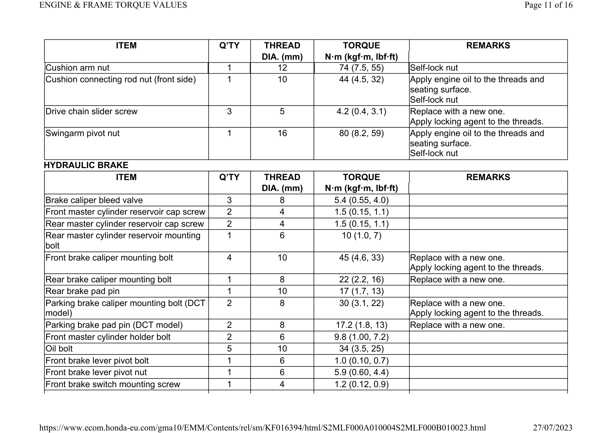

ITEM 
Q’TY 
THREAD 
TORQUE 
REMARKS 
DIA. (mm) 
N·m (kgf·m, lbf·ft) 
Cushion arm nut 
1 
12 
74 (7.5, 55) 
Self-lock nut 
Cushion connecting rod nut (front side) 
1 
10 
44 (4.5, 32) 
Apply engine oil to the threads and 
seating surface. 
Self-lock nut 
Drive chain slider screw 
3 
5 
4.2 (0.4, 3.1) 
Replace with a new one. 
Apply locking agent to the threads. 
Swingarm pivot nut 
1 
16 
80 (8.2, 59) 
Apply engine oil to the threads and 
seating surface. 
Self-lock nut 
HYDRAULIC BRAKE 
ITEM 
Q’TY 
THREAD 
TORQUE 
REMARKS 
DIA. (mm) 
N·m (kgf·m, lbf·ft) 
Brake caliper bleed valve 
3 
8 
5.4 (0.55, 4.0) 
Front master cylinder reservoir cap screw 
2 
4 
1.5 (0.15, 1.1) 
Rear master cylinder reservoir cap screw 
2 
4 
1.5 (0.15, 1.1) 
Rear master cylinder reservoir mounting 
bolt 
1 
6 
10 (1.0, 7) 
Front brake caliper mounting bolt 
4 
10 
45 (4.6, 33) 
Replace with a new one. 
Apply locking agent to the threads. 
Rear brake caliper mounting bolt 
1 
8 
22 (2.2, 16) 
Replace with a new one. 
Rear brake pad pin 
1 
10 
17 (1.7, 13) 
Parking brake caliper mounting bolt (DCT 
model) 
2 
8 
30 (3.1, 22) 
Replace with a new one. 
Apply locking agent to the threads. 
Parking brake pad pin (DCT model) 
2 
8 
17.2 (1.8, 13) 
Replace with a new one. 
Front master cylinder holder bolt 
2 
6 
9.8 (1.00, 7.2) 
Oil bolt 
5 
10 
34 (3.5, 25) 
Front brake lever pivot bolt 
1 
6 
1.0 (0.10, 0.7) 
Front brake lever pivot nut 
1 
6 
5.9 (0.60, 4.4) 
Front brake switch mounting screw 
1 
4 
1.2 (0.12, 0.9) 

ITEM 
Q’TY 
THREAD 
TORQUE 
REMARKS 
DIA. (mm) 
N·m (kgf·m, lbf·ft) 
Rear master cylinder mounting bolt 
2 
6 
14 (1.4, 10) 
Rear master cylinder connector screw 
1 
4 
1.5 (0.15, 1.1) 
Rear master cylinder push rod lock nut 
1 
8 
17.2 (1.8, 13) 
Front brake caliper assembly torx bolt 
6 
8 
27 (2.8, 20) 
Apply locking agent to the threads. 
Rear brake caliper pin bolt 
1 
12 
27 (2.8, 20) 
Parking brake lever cap screw 
2 
5 
4.2 (0.43, 3) 
Parking brake caliper pin bolt (DCT 
model) 
1 
8 
22 (2.2, 16) 
Apply locking agent to the threads. 
Parking brake adjuster lock nut (DCT 
model) 
1 
8 
17.2 (1.8, 13) 
ANTI-LOCK BRAKE SYSTEM (ABS) 
ITEM 
Q’TY 
THREAD 
TORQUE 
REMARKS 
DIA. (mm) 
N·m (kgf·m, lbf·ft) 
Brake hose guide screw 
2 
5 
1.2 (0.12, 0.9) 
Replace with a new one. 
Brake hose clamp screw 
1 
5 
1.2 (0.12, 0.9) 
Replace with a new one. 
Oil bolt 
5 
10 
34 (3.5, 25) 
Brake pipe joint nut 
4 
10 
14 (1.4, 10) 
Apply brake fluid to the threads. 
LIGHTS/METERS/SWITCHES/OTHER ELECTRONIC CONTROL UNITS 
ITEM 
Q’TY 
THREAD 
TORQUE 
REMARKS 
DIA. (mm) 
N·m (kgf·m, lbf·ft) 
License light bolt 
2 
4 
2.0 (0.20, 1.5) 
Meter/MID screw 
7 
5 
1.0 (0.10, 0.7) 
Open air temperature sensor screw 
1 
4 
1.2 (0.12, 0.9) 
EOP switch (MT model) 
1 
PT 1/8 
12 (1.2, 9) 
Apply sealant to the threads. 
EOP switch terminal bolt/washer (MT 
model) 
1 
4 
2.0 (0.20, 1.5) 
Ignition switch mounting bolt 
2 
8 
26 (2.7, 19) 
Replace with a new one. 
Left handlebar switch screw 
2 
5 
2.5 (0.25, 1.8) 

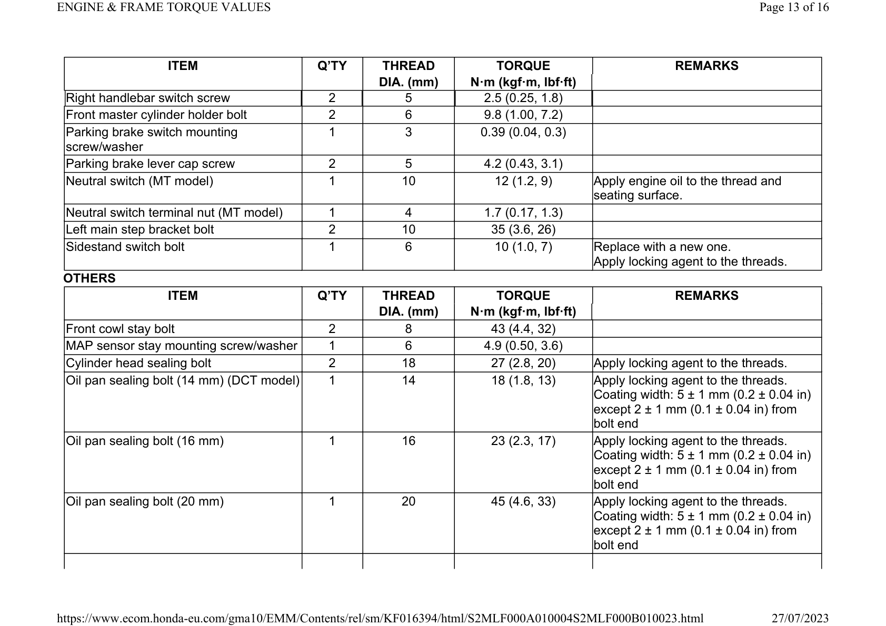

ITEM 
Q’TY 
THREAD 
TORQUE 
REMARKS 
DIA. (mm) 
N·m (kgf·m, lbf·ft) 
Right handlebar switch screw 
2 
5 
2.5 (0.25, 1.8) 
Front master cylinder holder bolt 
2 
6 
9.8 (1.00, 7.2) 
Parking brake switch mounting 
screw/washer 
1 
3 
0.39 (0.04, 0.3) 
Parking brake lever cap screw 
2 
5 
4.2 (0.43, 3.1) 
Neutral switch (MT model) 
1 
10 
12 (1.2, 9) 
Apply engine oil to the thread and 
seating surface. 
Neutral switch terminal nut (MT model) 
1 
4 
1.7 (0.17, 1.3) 
Left main step bracket bolt 
2 
10 
35 (3.6, 26) 
Sidestand switch bolt 
1 
6 
10 (1.0, 7) 
Replace with a new one. 
Apply locking agent to the threads. 
OTHERS 
ITEM 
Q’TY 
THREAD 
TORQUE 
REMARKS 
DIA. (mm) 
N·m (kgf·m, lbf·ft) 
Front cowl stay bolt 
2 
8 
43 (4.4, 32) 
MAP sensor stay mounting screw/washer 
1 
6 
4.9 (0.50, 3.6) 
Cylinder head sealing bolt 
2 
18 
27 (2.8, 20) 
Apply locking agent to the threads. 
Oil pan sealing bolt (14 mm) (DCT model) 
1 
14 
18 (1.8, 13) 
Apply locking agent to the threads. 
Coating width: 5 ± 1 mm (0.2 ± 0.04 in) 
except 2 ± 1 mm (0.1 ± 0.04 in) from 
bolt end 
Oil pan sealing bolt (16 mm) 
1 
16 
23 (2.3, 17) 
Apply locking agent to the threads. 
Coating width: 5 ± 1 mm (0.2 ± 0.04 in) 
except 2 ± 1 mm (0.1 ± 0.04 in) from 
bolt end 
Oil pan sealing bolt (20 mm) 
1 
20 
45 (4.6, 33) 
Apply locking agent to the threads. 
Coating width: 5 ± 1 mm (0.2 ± 0.04 in) 
except 2 ± 1 mm (0.1 ± 0.04 in) from 
bolt end 

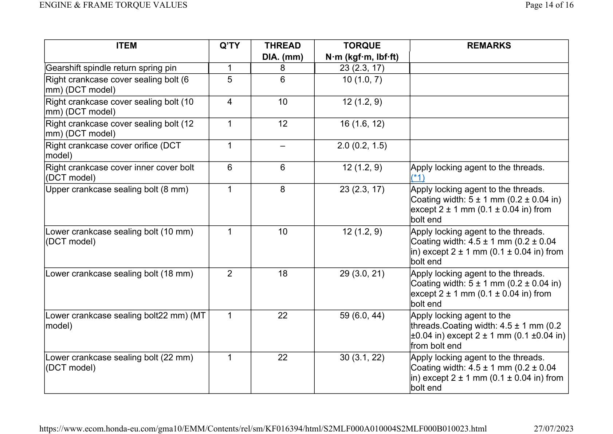

ITEM 
Q’TY 
THREAD 
TORQUE 
REMARKS 
DIA. (mm) 
N·m (kgf·m, lbf·ft) 
Gearshift spindle return spring pin 
1 
8 
23 (2.3, 17) 
Right crankcase cover sealing bolt (6 
mm) (DCT model) 
5 
6 
10 (1.0, 7) 
Right crankcase cover sealing bolt (10 
mm) (DCT model) 
4 
10 
12 (1.2, 9) 
Right crankcase cover sealing bolt (12 
mm) (DCT model) 
1 
12 
16 (1.6, 12) 
Right crankcase cover orifice (DCT 
model) 
1 
– 
2.0 (0.2, 1.5) 
Right crankcase cover inner cover bolt 
(DCT model) 
6 
6 
12 (1.2, 9) 
Apply locking agent to the threads. 
(*1) 
Upper crankcase sealing bolt (8 mm) 
1 
8 
23 (2.3, 17) 
Apply locking agent to the threads. 
Coating width: 5 ± 1 mm (0.2 ± 0.04 in) 
except 2 ± 1 mm (0.1 ± 0.04 in) from 
bolt end 
Lower crankcase sealing bolt (10 mm) 
(DCT model) 
1 
10 
12 (1.2, 9) 
Apply locking agent to the threads. 
Coating width: 4.5 ± 1 mm (0.2 ± 0.04 
in) except 2 ± 1 mm (0.1 ± 0.04 in) from 
bolt end 
Lower crankcase sealing bolt (18 mm) 
2 
18 
29 (3.0, 21) 
Apply locking agent to the threads. 
Coating width: 5 ± 1 mm (0.2 ± 0.04 in) 
except 2 ± 1 mm (0.1 ± 0.04 in) from 
bolt end 
Lower crankcase sealing bolt22 mm) (MT 
model) 
1 
22 
59 (6.0, 44) 
Apply locking agent to the 
threads.Coating width: 4.5 ± 1 mm (0.2 
±0.04 in) except 2 ± 1 mm (0.1 ±0.04 in) 
from bolt end 
Lower crankcase sealing bolt (22 mm) 
(DCT model) 
1 
22 
30 (3.1, 22) 
Apply locking agent to the threads. 
Coating width: 4.5 ± 1 mm (0.2 ± 0.04 
in) except 2 ± 1 mm (0.1 ± 0.04 in) from 
bolt end 

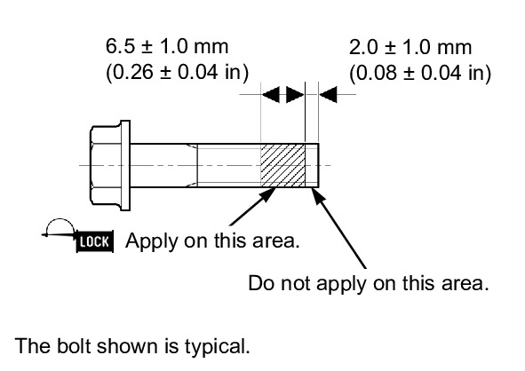

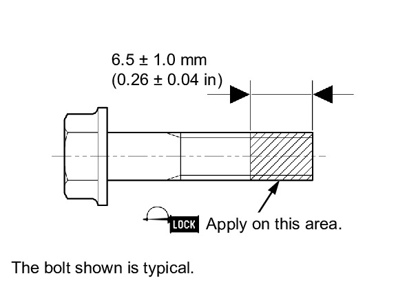

*1: Apply locking agent to the threads as shown. 
*2: Apply locking agent to the threads as shown. 

