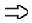
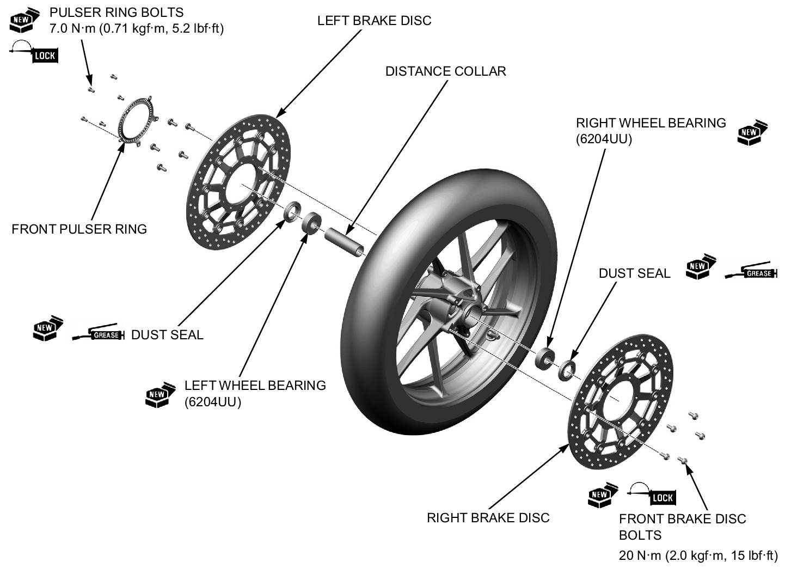
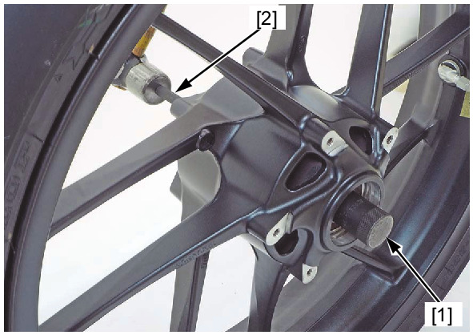
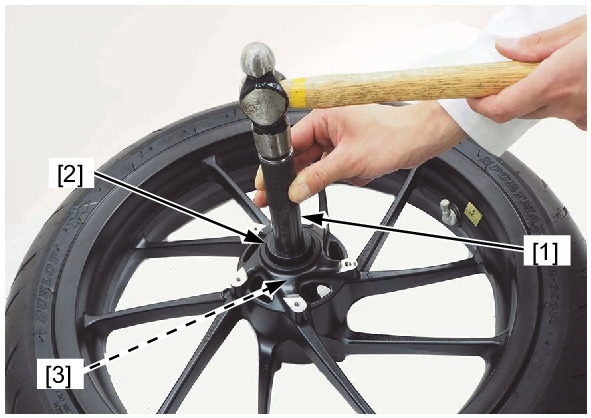

# Wheels - Front Disassembly&Assembly

Источник: `Wheels - Front Disassembly&Assembly.pdf`

DISASSEMBLY/ASSEMBLY 
Disassemble and assemble the front wheel as shown in the following illustration. 
* Replace the front wheel dust seals and front brake disc mounting bolts with new ones. 
* Apply grease to the front wheel dust seal lips. 
* Apply locking agent to the front brake disk bolt and pulser ring bolt threads. 
* Install the front wheel dust seal until it is flush with the wheel hub surface. 
* Install the front brake disc with the " 
 " marked side facing out. 

WHEEL BEARING REPLACEMENT 
Install the bearing remover head [1] into the bearing. 
From the opposite side, install the bearing remover shaft 14 x 400L [2] and drive out the bearing from the wheel hub. 
Remove the distance collar and drive out the other bearing. 
TOOLS: 
Remover head 20 mm 
07746-0050600 
Bearing remover shaft 14 x 400L 07GGD-0010100 
Drive in a new right side bearing squarely with its marked side facing up until it is fully seated. 
! Never install the old bearing, once the bearing has been removed, the 
bearing must be replaced with new ones. 
Install the distance collar. 
Drive in a new left side bearing squarely with its marked side facing up until it is seated on the distance collar. 
TOOLS: 
Driver handle, 15 x 135L [1] 07749-0010000 
Attachment, 42 x 47 mm [2] 07746-0010300 
Pilot 20 mm [3] 
07746-0040500 

