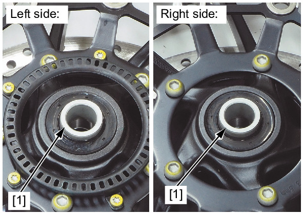
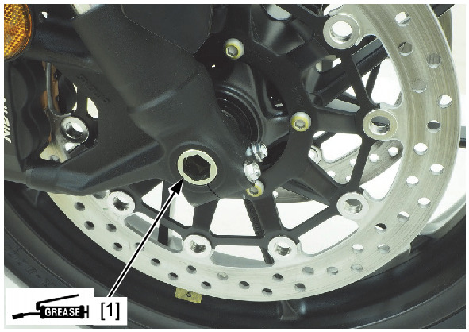
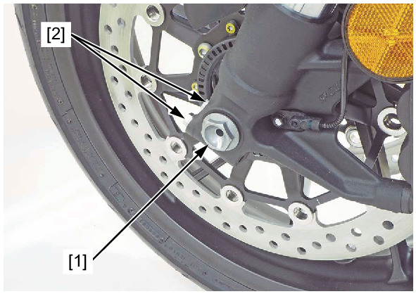
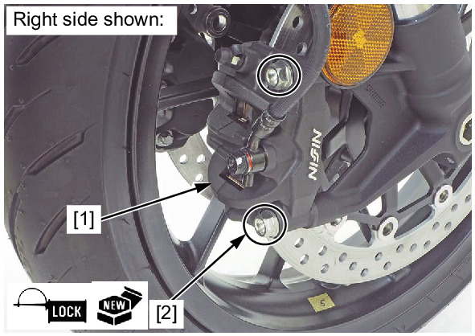
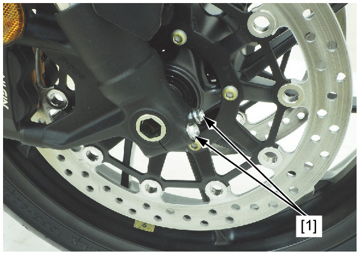

# Wheels - Front Install

Источник: `Wheels - Front Install.pdf`

INSTALLATION 
Install the side collars [1] to the front wheel. 
Apply a thin coat of grease to the front axle sliding surface. 
Install the front wheel between the forks. 

NOTE: 
* Be careful not to damage the pulser ring. 
Install the front axle [1] from the right side. 

Install and tighten the front axle nut [1] to the specified torque. 
TORQUE: 59 N·m (6.0 kgf·m, 44 lbf·ft) 
Tighten the left front axle holder pinch bolts [2] to the specified torque. 
TORQUE: 27 N·m (2.8 kgf·m, 20 lbf·ft) 
Apply locking agent to the front brake caliper mounting bolt [1] threads. 
Install the front brake calipers [2] and new front brake caliper mounting bolts. 
Tighten the front brake caliper mounting bolts to the specified torque. 
TORQUE: 45 N·m (4.6 kgf·m, 33 lbf·ft) 
With the front brake applied, pump the forks up and down several times to seat the axle and check brake operation. 

Tighten the right front axle holder pinch bolts [1] to the specified torque. 
TORQUE: 27 N·m (2.8 kgf·m, 20 lbf·ft) 
Check the clearance gap between the front wheel speed sensor bracket and pulser ring . 

