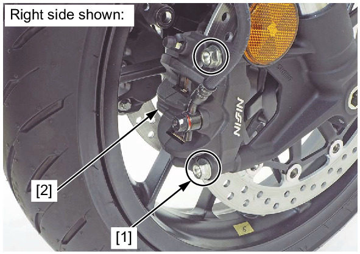
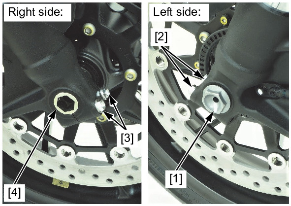
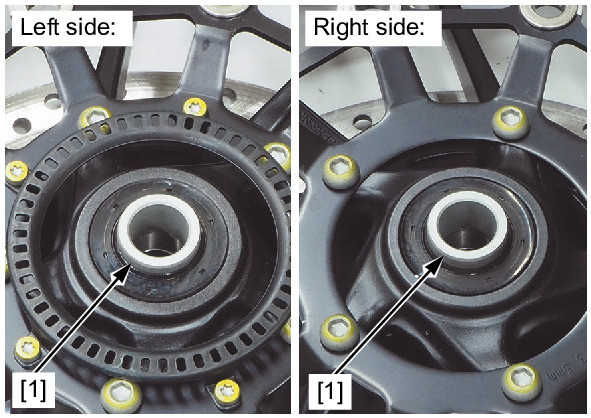

# Wheels - Front Removal

Источник: `Wheels - Front Removal.pdf`

REMOVAL 
Remove the front brake caliper mounting bolts [1] and front brake calipers [2]. 

NOTE: 
* Do not suspend the front brake caliper from the brake hose. Do not twist the brake hose. 
* Do not operate the brake lever after removing the front brake calipers. 
Remove the front axle bolt [1]. 
Loosen the left front axle holder pinch bolts [2]. 
Loosen the right front axle holder pinch bolts [3]. 
Support the motorcycle using a safety stand or hoist, raise the front wheel off the ground. 
Remove the front axle [4] and front wheel. 

Remove the side collars [1]. 

