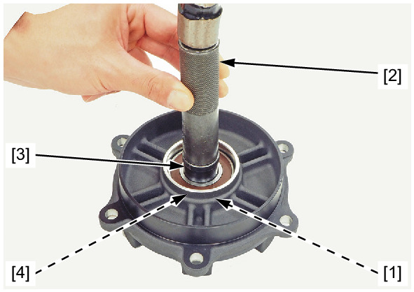
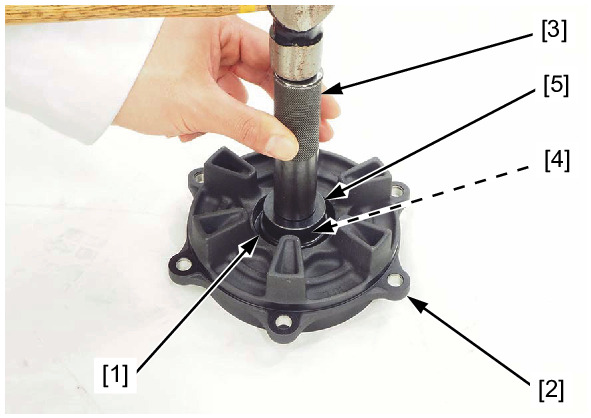
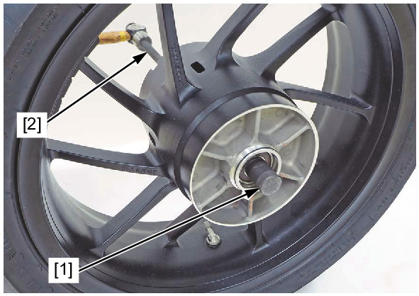
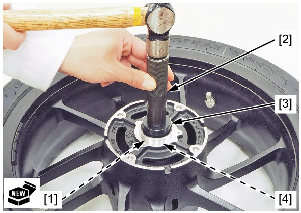
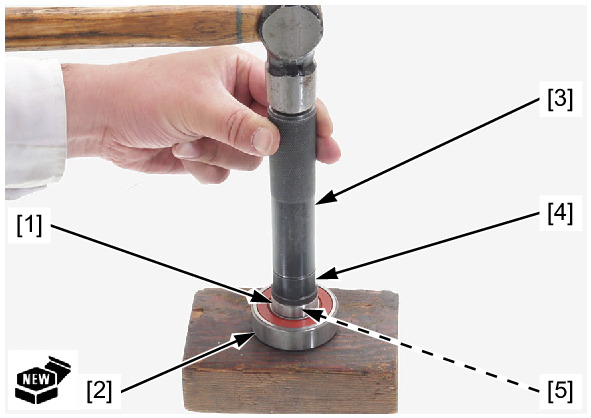
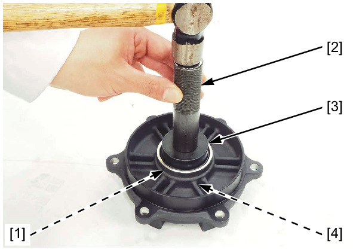

# Wheels - Rear Bearing Replacement

Источник: `Wheels - Rear Bearing Replacement.pdf`

WHEEL BEARING REPLACEMENT 
Drive the rear wheel distance collar B [1] out of the driven flange bearing using the special tools. 
TOOLS: 
Driver handle, 15 x 135L [2] 
07749-0010000 
Bearing driver attachment, 28 x 30 [3] 07946-1870100 
Pilot 20 mm [4] 
07746-0040500 
Drive the driven flange bearing [1] out of the driven flange [2] using the special tools. 
TOOLS: 
Driver handle, 15 x 135L [3] 07749-0010000 
Attachment, 42 x 47 mm [4] 07746-0010300 
Pilot 28 mm [5] 
07746-0041100 

Install the remover head 20 mm [1] into the wheel bearing. 
From the opposite side, install the bearing remover shaft 14 x 400L [2] and drive the wheel bearing out of the wheel hub. 
TOOLS: 
Remover head 20 mm 
07746-0050600 
Bearing remover shaft 14 x 400L 07GGD-0010100 
Remove the distance collar and drive the other wheel bearing out. 
Drive in a new right wheel bearing [1] squarely until it is fully seated. 
TOOLS: 
Driver handle, 15 x 135L [2] 07749-0010000 
Attachment, 42 x 47 mm [3] 07746-0010300 
Pilot 20 mm [4] 
07746-0040500 

NOTE: 
* Replace the driven flange and wheel bearings as a set. 
* Do not reuse old bearings. 
Install the distance collar. 
Drive in a new left wheel bearing squarely until it is seated on the distance collar. 

Drive in the rear wheel distance collar B [1] to a new driven flange bearing [2]. 
TOOLS: 
Driver handle, 15 x 135L [3] 
07749-0010000 
Bearing driver attachment, 28 x 30 [4] 07946-1870100 
Pilot 20 mm [5] 
07746-0040500 

NOTE: 
* Replace the driven flange and wheel bearings as a set. 
* Do not reuse old bearing. 
Drive in the driven flange bearing/rear wheel distance collar B [1] squarely with the rear wheel distance collar B side facing 
down until it is fully seated. 
TOOLS: 
Driver handle, 15 x 135L [2] 07749-0010000 
Attachment, 52 x 55 mm [3] 07746-0010400 
Pilot 20 mm [4] 
07746-0040500 

