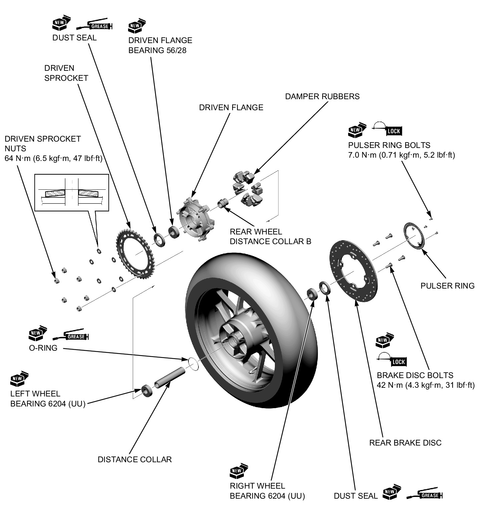

# Wheels - Rear Disassembly&Assembly

Источник: `Wheels - Rear Disassembly&Assembly.pdf`

DISASSEMBLY/ASSEMBLY 
Disassemble and assemble the rear wheel as shown in the following illustration. 
* Apply locking agent to the rear brake disk bolt and pulser ring bolt threads. 

