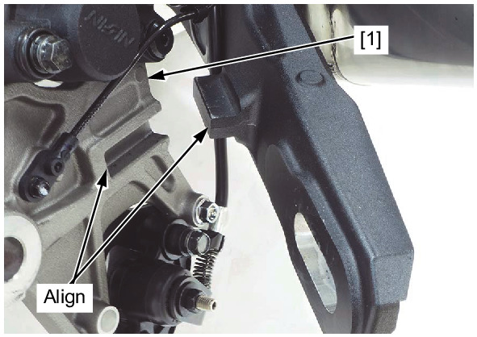
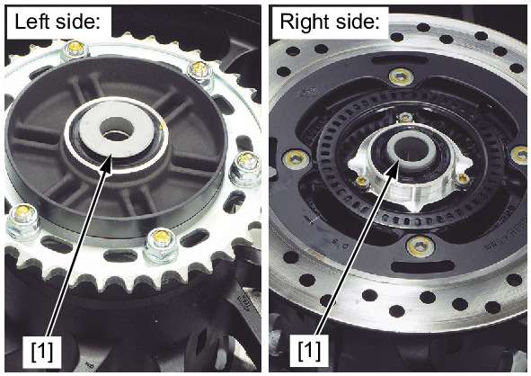
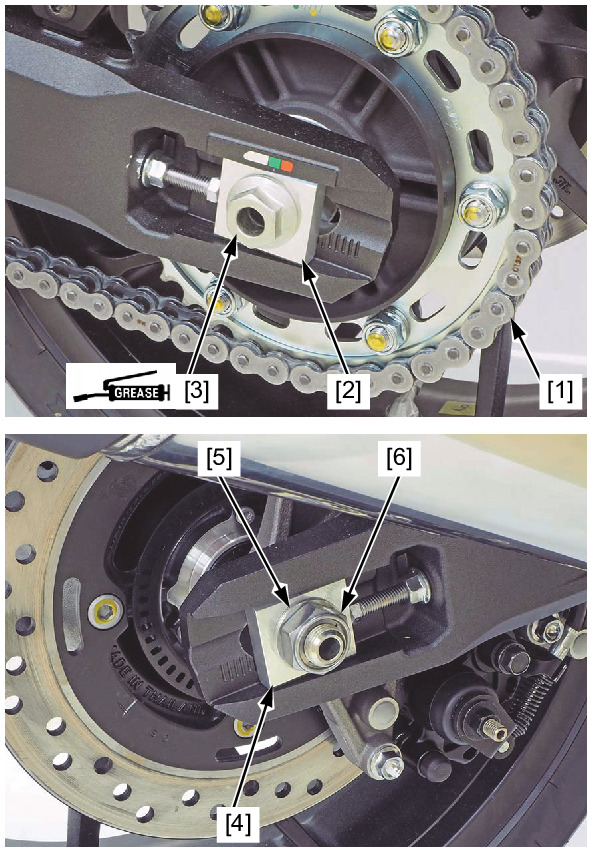

# Wheels - Rear Install

Источник: `Wheels - Rear Install.pdf`

INSTALLATION 
Install the rear brake caliper assembly [1] to the swingarm. 

NOTE: 
* Align the caliper bracket groove with swingarm guide. 
Install the side collars [1]. 

Apply a thin coat of grease to the rear axle outer surface. 
Install the rear wheel in the swingarm. 

NOTE: 
* Install the brake disc between the brake pads. 
* Be careful not to damage the brake pads. 
Install the drive chain [1] over the driven sprocket. 
Install the left adjusting plate [2] and rear axle [3] from the left side. 
Install the right adjusting plate [4], washer [5] and rear axle nut [6]. 
Adjust the drive chain slack . 
Check the clearance gap between the rear wheel speed sensor bracket and pulser ring . 

