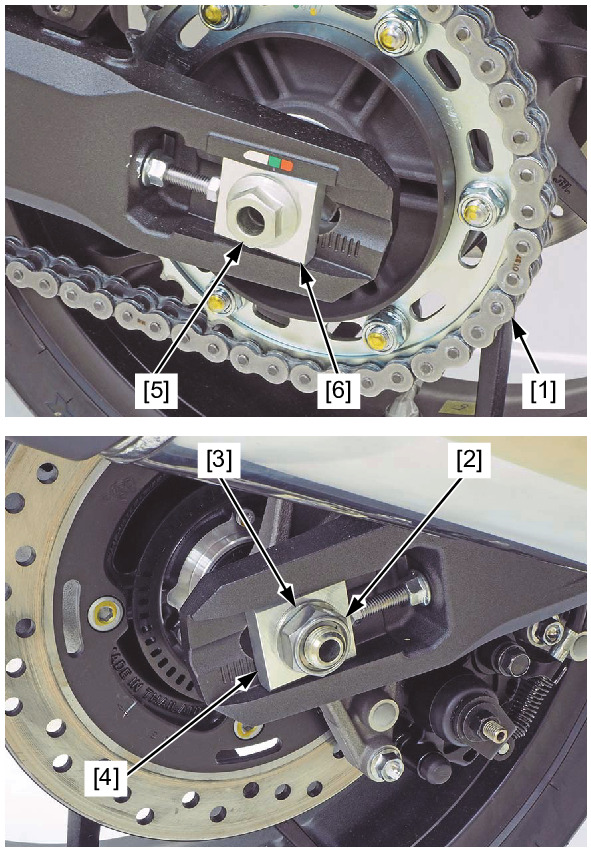
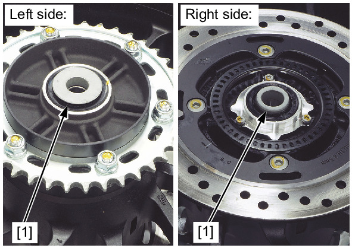

# Wheels - Rear Removal

Источник: `Wheels - Rear Removal.pdf`

REMOVAL 
Fully slacken the drive chain . 
Support the motorcycle using a safety stand or hoist, and raise the rear wheel off the ground. 
Push the rear wheel forward. 
Derail the drive chain [1] from the driven sprocket. 
Remove the rear axle nut [2], washer [3] and right adjusting plate [4]. 
Remove the rear axle [5], left adjusting plate [6] and rear wheel. 

NOTE: 
* Do not suspend the rear brake caliper assembly from the brake hose. Do not twist the brake hose. 
* Do not operate the brake pedal after removing the rear wheel. 

NOTE: 
* Do not operate the parking brake lever after removing the rear wheel. 
! DCT model: 

Remove the side collars [1]. 

