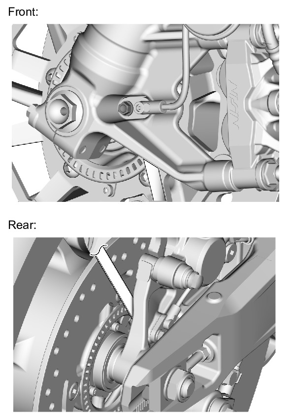

# Wheels - Speed Sensor Gaps

Источник: `Wheels - Speed Sensor Gaps.pdf`

CLEARANCE GAP INSPECTION 
Support the motorcycle securely using a hoist or equivalent and raise the front or rear wheel off the ground. 
Measure the clearance gap between the sensor bracket and pulser ring at several points by turning the wheel slowly. 
It must be within specification. 
STANDARD: 
FRONT: 0.70 – 1.30 mm (0.028 – 0.051 in) 
REAR: 0.80 – 1.40 mm (0.031 – 0.055 in) 
The sensor clearance gap cannot be adjusted. 
If it is not within specification, check each installation part for deformation, looseness, or damage. 

