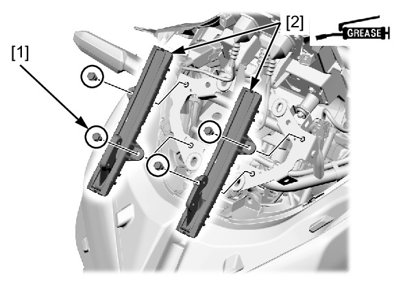

# Windscreen Rail

Источник: `Windscreen Rail.pdf`

REMOVAL/INSTALLATION 
Remove the front cowl . 
Remove the windscreen adjust rail bolts [1] and 
windscreen adjust rail [2]. 
Installation is in the reverse order of removal. 

NOTE: 
* Check the windscreen adjustment for smooth 
operation. Apply grease to the slider guides if 
there is any unsmooth or heavy operation. 
* If there is an excessive looseness at the 
windscreen slider or if the windscreen falls 
down in riding by the sliding are worn, 
replace the guides as new ones. 

