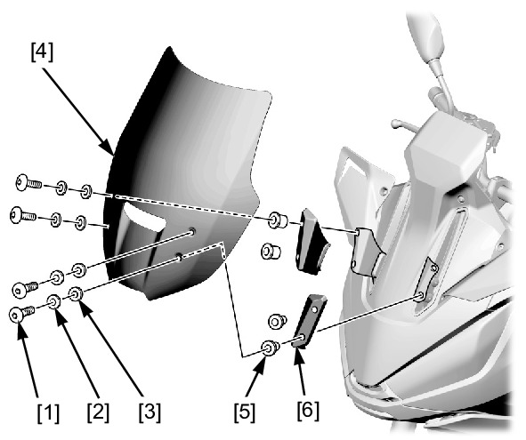

# Windscreen Remove&Install

Источник: `Windscreen Remove&Install.pdf`

REMOVAL/INSTALLATION 
Remove the following: 
* Windscreen socket bolts [1] 
* Plastic washers [2] 
* Rubber washers [3] 
* Windscreen [4] 
Remove the well nuts [5] and windscreen bracket 
cover [6]. 
Installation is in the reverse order of removal. 
TORQUE: 
Windscreen socket bolt: 
0.54 N·m (0.06 kgf·m, 0.4 lbf·ft) 

