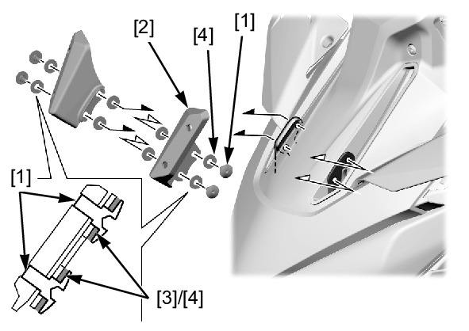

# Windscreen Stay

Источник: `Windscreen Stay.pdf`

REMOVAL/INSTALLATION 
Remove the windscreen . 
Loosen the windscreen stay bolts [1] until the 
windscreen stay [2] is removable. 
Remove the windscreen stay. 
Installation is in the reverse order of removal. 
TORQUE: 
Windscreen stay socket bolt: 
12 N·m (1.2 kgf·m, 9 lbf·ft) 

NOTE: 
* Apply the soap water to the contact surface 
[3] between the windscreen stay bolts and 
rubber washers [4] when assembling. 

