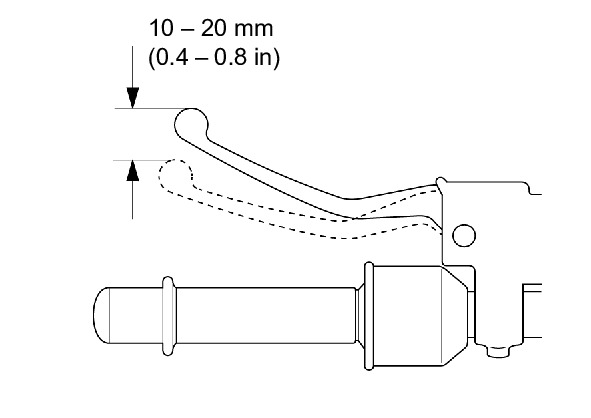
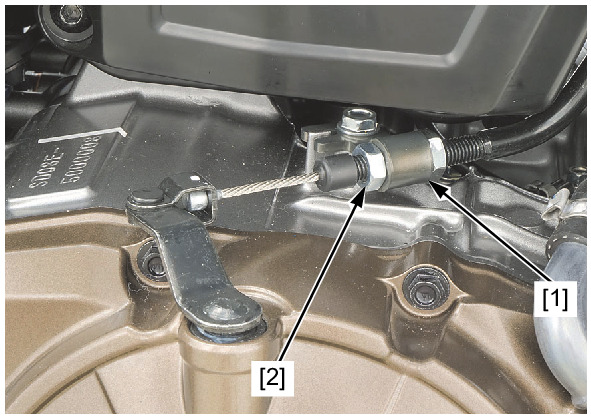

# Clutch System

CLUTCH SYSTEM (MT model)

Measure the clutch lever freeplay at the end of the
clutch lever.

**FREEPLAY:** 10–20 mm (0.4 –0.8 in)

Major adjustment is made with the lower adjusting
nut [1] at the clutch lifter arm.

Loosen the lock nut [2] and turn the adjusting nut to

