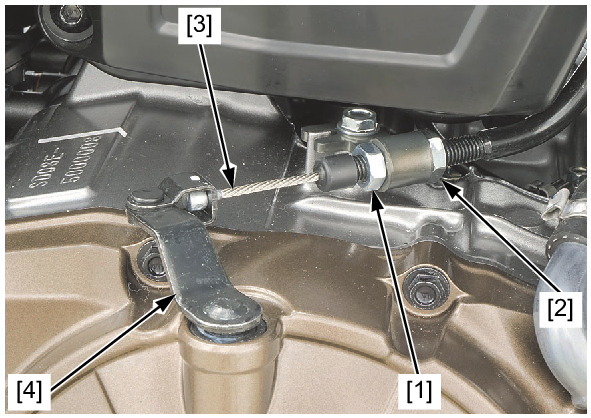
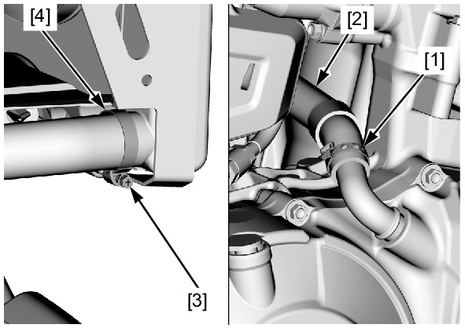
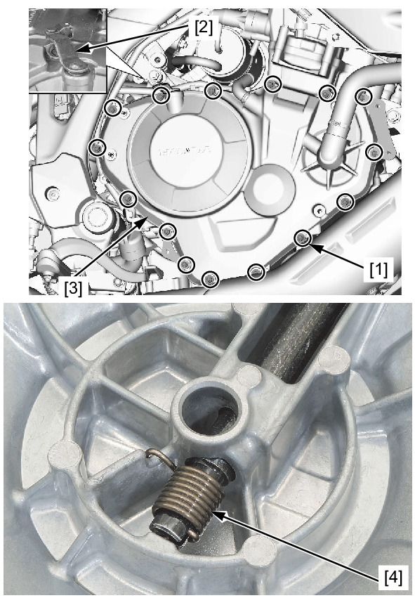
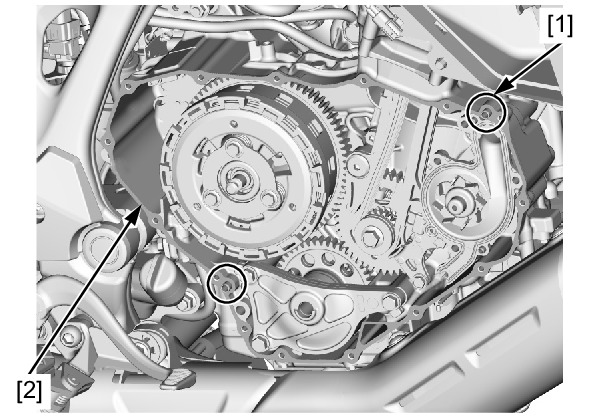
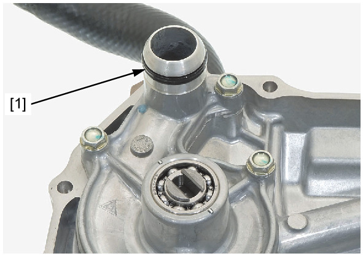

# Cover-Crankcase Right Remove

REMOVAL

Drain the engine oil.  
Drain the coolant.  
Remove the right rear engine cover.  
Loosen the lock nut [1] and lower adjusting nut [2].  
Disconnect the clutch cable [3] from the clutch lifter lever [4].

Cut off and remove the hose clamp [1].  
Disconnect the bypass hose [2].  
Loosen the hose band screw [3].  
Disconnect the radiator lower hose [4].

Remove the right crankcase cover bolts [1].  
Turn the clutch lifter lever [2] counterclockwise to disengage the lifter lever slit from the clutch lifter pin.  
Remove the right crankcase cover [3].

**NOTE:**
* Be careful not to drop the return spring.

Remove the dowel pins [1] and gasket [2].

Remove the O-ring [1].

