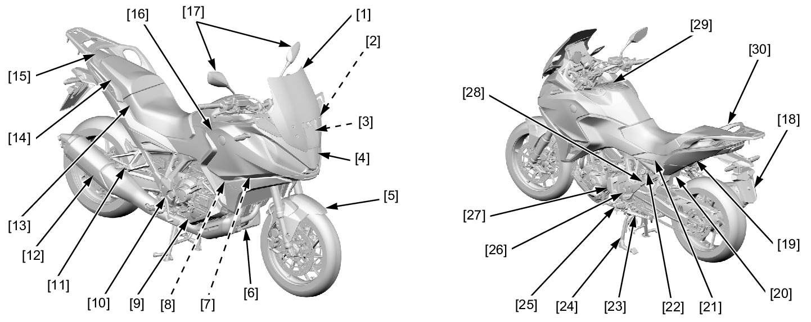

# Cowl&Cover - Locations

BODY PANEL LOCATIONS

* [1] Windscreen
* [2] Windscreen stay
* [3] Windscreen adjust rail
* [4] Front cowl
* [5] Front fender
* [6] Under cover
* [7] Inner cover
* [8] Side cover
* [9] Clutch EOP sensor cover (DCT model)
* [10] Right rear engine cover
* [11] Pillion step
* [12] Muffler/exhaust pipe
* [13] Main seat
* [14] Pillion seat
* [15] Rear center cowl
* [16] Middle cowl
* [17] Rearview mirror
* [18] Rear fender A
* [19] Rear fender B
* [20] Regulator/rectifier cover
* [21] Rear side cowl
* [22] Seat catch hook/seat lock cylinder
* [23] Sidestand
* [24] Mainstand
* [25] Main step
* [26] Heel guard
* [27] Left rear cover
* [28] Seat rail
* [29] Tank front cover
* [30] Rear carrierDeflector cover (MT model)

[BODY PANEL REMOVAL CHART](../Cowl%26Cover-Removal-Chart/Cowl%26Cover-Removal-Chart.md)