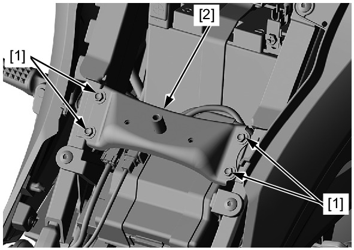

# Frame - Cross Plate (Fuel Tank)

REMOVAL/INSTALLATION

Remove the Fuel tank.  
Remove the front cross plate bolts [1] and front
cross plate [2].  
Installation is in the reverse order of removal.

**TORQUE:**
* Front cross plate bolt: **12 N·m** (1.2 kgf·m, 9 lbf·ft)

