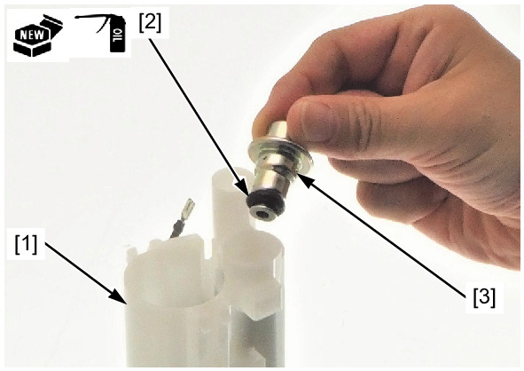
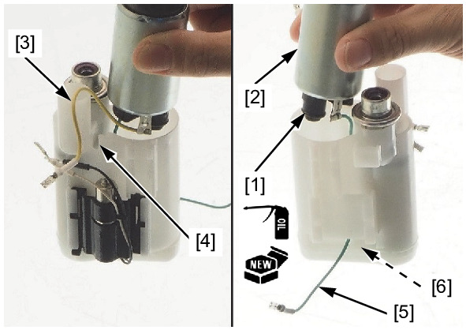
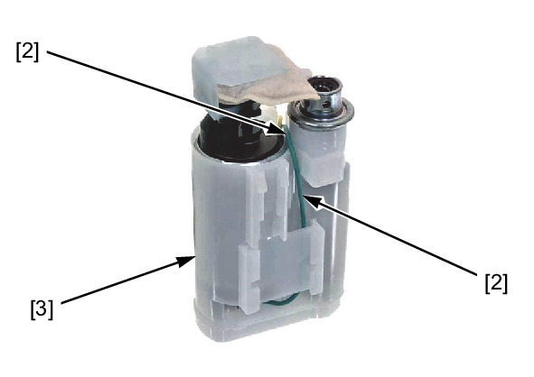
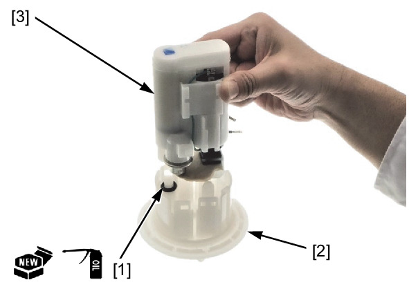
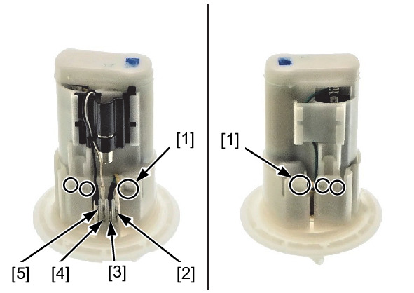

# Fuel - Pump Assembly

ASSEMBLY

Replace the fuel filter [1] with a new one.

Apply engine oil to a new O-ring.

Install the O-ring [2] to new pressure regulator [3].

Install the pressure regulator.

Apply engine oil to a new O-ring.

Install the O-ring [1] to the fuel pump [2].

Install the fuel pump.

**NOTE:**
* Align the Yellow wire [3] with the fuel filter groove [4].
* Lead the Green wire [5] through the hole [6] of the fuel filter as shown.

Set the Green wire [1] through the groove [2] of the fuel filter [3] as shown.

Apply engine oil to a new O-ring.

Install the O-ring [1] to the flange [2].

Install the fuel filter unit [3].

Install the following:
* Tabs [1]
* Yellow wire connector [2]
* Green wire connector [3]
* White wire connector [4]
* Black wire connector [5]

