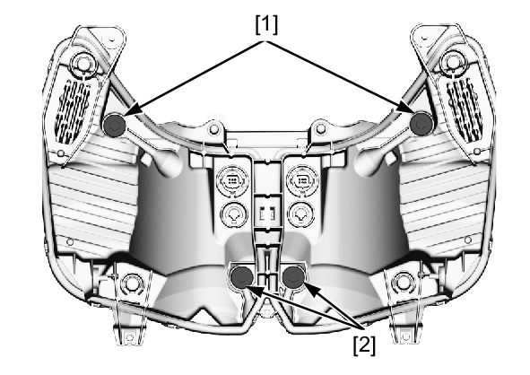

# Headlight Aim

HEADLIGHT AIM

Place the motorcycle on a level surface.

Adjust the headlight aim vertically by turning the
vertical beam adjusting screw [1].

Adjust horizontally by turning the horizontal adjusting
screws [2].

**NOTE:**
lAdjust the headlight beam as specified by local
laws and regulations.

